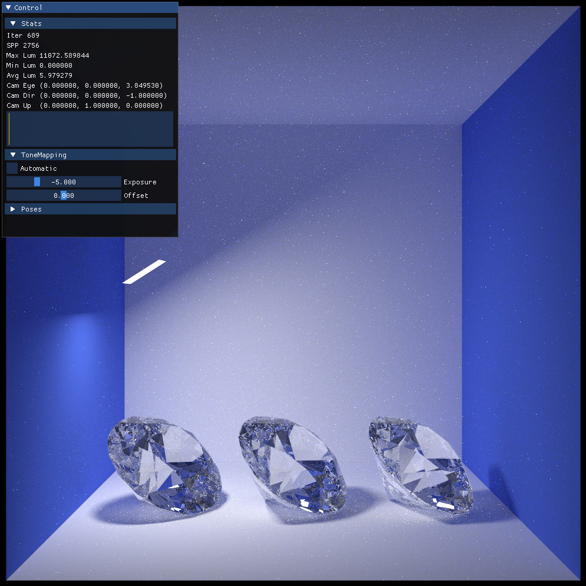

# Ignis Rodent

'Ignis Rodent' is a raytracer for the RENEGADE project implemented using the Artic frontend of the AnyDSL compiler framework (https://anydsl.github.io/) and based on Rodent (https://github.com/AnyDSL/rodent).

## Dependencies

 - AnyDSL <https://github.com/AnyDSL/anydsl>
 - Eigen3 <http://eigen.tuxfamily.org>
 - OpenImageIO <https://sites.google.com/site/openimageio/home>
 - Intel® Threading Building Blocks https://www.threadingbuildingblocks.org/
 - ZLib <https://zlib.net/>

### Optional

 - SDL2 <https://www.libsdl.org/>

### Integrated
The following dependencies will be downloaded and compiled automatically.
Have a look at [CPM](https://github.com/cpm-cmake/CPM.cmake) for more information. 

 - imgui <https://github.com/ocornut/imgui>
 - pugixml <https://github.com/zeux/pugixml>
 - RapidJSON <https://rapidjson.org/>
 - Simple Hardware Feature Extractor <https://github.com/PearCoding/hwinfo>
 - Simple Tag Preprocessor <https://github.com/PearCoding/stpp>
 - tinyobjloader <https://github.com/tinyobjloader/tinyobjloader>

## Building

Once the dependencies are installed, first create a directory to build the application in:

    mkdir build
    cd build

Use your favorite generator (e.g. `Ninja`)

    cmake -G Ninja ..
    cmake --build .

If `Ninja` is not available you may skip the `-G Ninja` parameter. You can also set `FETCHCONTENT_UPDATES_DISCONNECTED` to `ON` to speed up the cmake steps after the initial cmake step.  

## Backends

Multiple device and feature specific modules, so-called drivers, will be compiled. They are the backend of the raytracer.

The compilation process might take a while depending on your hardware and feature selection, as parallel compilation of the drivers is disabled by default. Multithreading might make your operating system unresponsive. You can use the CMake option `IG_BUILD_DRIVER_PARALLEL` to enable it if you like.

## Frontends

Currently, four frontends are available:

 - `igview` This is the standard UI interface which essentially shows you how the scene is progressively rendered. Good to have a first impression of the rendered scene. Keep in mind that some power of your underlying hardware is used to render the UI and the tonemapping algorithms. Switching to the UI-less frontend `igcli` might be a good idea if no preview is necessary. Note, `igview` will be only available if the UI feature is enabled and SDL2 is available in the environment. You might disable this entirely by setting the CMake option `IG_WITH_VIEWER` to Off.
 - `igcli` The commandline only frontend is the same as `igview` but without any UI specific features. In contrary to `igview`, `igcli` requires a maximum iteration or time to be given to the application by the user, as progressive rendering is not that useful without a preview. (We might add progressive rendering back, but I need a convincing argument for that...)
 - `igtrace` This commandline only frontend ignores camera specific information and expects a list of rays from the user. It returns the contribution as a list back to the user for each ray.
 - `Python API` A simple python API is available, if Python3 was found in the environment. You might disable this entirely by setting the CMake option `IG_WITH_PYTHON_API` to Off.

Use the `--help` argument on each of the executables to get information of possible arguments for each frontend. Also have a look at the Wiki(TODO) and Website(TODO) for more in-depth information.

## Running

To make it possible to run the raytracer the frontend requires the exact location where backends are located. The environment variable `IG_DRIVER_PATH` has to point to the directories containing the driver modules. The environment variable is similar to the `PATH` variable used in Linux environments and should contain absolute paths only, separated by ':' if multiple paths are provided.

One upcoming feature will be to make the search process to work out of the box and not rely only on `IG_DRIVER_PATH`.

Nevertheless, for now define the environment variable like this on Linux systems:

    export IG_DRIVER_PATH=<IGNIS_INSTALL_PATH>/lib

Replace "<IGNIS_INSTALL_PATH>" with an absolute path to the place the framework was installed to. 

Now you might run a frontend of your choice like this:

    igview scene/diamond_scene.json

If a system wide environment variable is not defined, you might also use the following approach on Linux:

    IG_DRIVER_PATH=<IGNIS_INSTALL_PATH>/lib <IGNIS_INSTALL_PATH>/bin/igview scene/diamond_scene.json

## Scene description

Ignis Rodent uses a JSON based flat scene description with instancing. Support for shading nodes is planned. Image and procedural texture support is available.
A schema is available at [refs/ignis.schema.json](refs/ignis.schema.json)

You might use the `mts2ig` to convert a Mitsuba scene description to our own format. Keep in mind that this feature is very experimental and not all BSDFs work out of the box.

A Blender plugin and a Radiance scene converter are planned.

## Tiny tools

Two tiny tools `exr2hdr` and `hdr2exr` are available to convert between the Radiance favorite image format HDR to the advanced OpenEXR format and vice versa.

This is useful to ease the transfer from Radiance to our raytracer, but you can disable them by setting the CMake option `IG_WITH_TOOLS` to Off.

Actually, the tool might even convert to any format the OpenImageIO framework supports...

## How to use `igview`

The Ignis Rodent client has an optional UI and multiple ways to interact with the scene:

 - `1..9` number keys to switch between views.
 - `1..9` and `Strg/Ctrl` to save the current view on that slot.
 - `F1` to toggle the help window.
 - `F2` to toggle the UI.
 - `F3` to toggle the interaction lock. If enabled, no view changing interaction is possible.
 - `F11` to save a snapshot of the current rendering. HDR information will be preserved. Use with `Strg/Ctrl` to make a LDR screenshot of the current render including UI and tonemapping. The image will be saved in the current working directory.
 - `R` to reset to initial view.
 - `P` to pause current rendering. Also implies an interaction lock.
 - `T` to toggle automatic tonemapping.
 - `G` to reset tonemapping properties. Only works if automatic tonemapping is disabled.
 - `F` to increase (or with `Shift` to decrease) tonemapping exposure. Step size can be decreased with `Strg/Ctrl`. Only works if automatic tonemapping is disabled.
 - `V` to increase (or with `Shift` to decrease) tonemapping offset. Step size can be decreased with `Strg/Ctrl`. Only works if automatic tonemapping is disabled.
 - `WASD` or arrow keys to travel through the scene.
 - `Q/E` to rotate the camera around the viewing direction. 
 - `PageUp/PageDown` to pan the camera up and down. 
 - `Notepad +/-` to change the travel speed.
 - `Numpad 1` to switch to front view.
 - `Numpad 3` to switch to side view.
 - `Numpad 7` to switch to top view.
 - `Numpad 9` look behind you.
 - `Numpad 2468` to rotate the camera.
 - Mouse to rotate the camera. `Shift` will move slower, `Strg/Ctrl` will move faster. Use with `Alt` to enable first person camera behaviour. 
