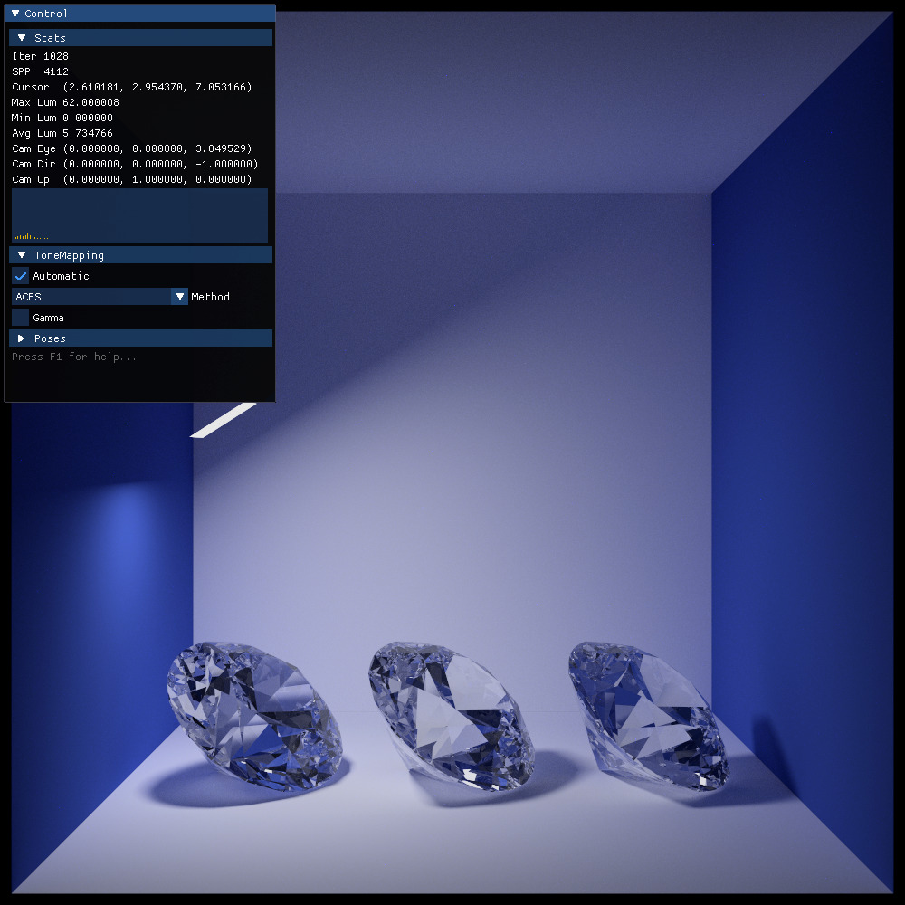
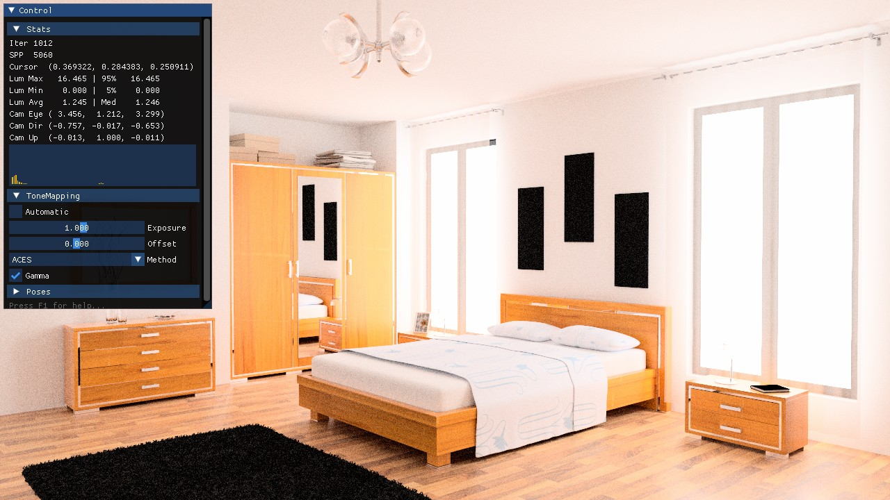
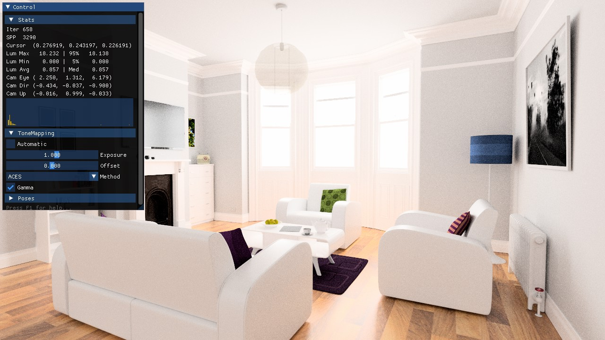

# Ignis
'Ignis' is a raytracer for the RENEGADE project implemented using the Artic frontend of the AnyDSL compiler framework (https://anydsl.github.io/) and based on Rodent (https://github.com/AnyDSL/rodent).

## Gallery

Some scenes rendered with Ignis. Acquired from https://benedikt-bitterli.me/resources/ and converted from Mitsuba to our own format. Both images took roughly one minute to render. With an RTX 2080 Super you can even have an interactive view of the scene.

## Dependencies

 - AnyDSL <https://github.com/AnyDSL/anydsl>
 - Eigen3 <http://eigen.tuxfamily.org>
 - Intel® Threading Building Blocks https://www.threadingbuildingblocks.org/
 - ZLib <https://zlib.net/>

### Optional

 - SDL2 <https://www.libsdl.org/>

### Integrated
The following dependencies will be downloaded and compiled automatically.
Have a look at [CPM](https://github.com/cpm-cmake/CPM.cmake) for more information. 

 - imgui <https://github.com/ocornut/imgui>
 - imgui-markdown <https://github.com/juliettef/imgui_markdown>
 - pugixml <https://github.com/zeux/pugixml>
 - RapidJSON <https://rapidjson.org/>
 - Simple Hardware Feature Extractor <https://github.com/PearCoding/hwinfo>
 - Simple Tag Preprocessor <https://github.com/PearCoding/stpp>
 - stb <https://github.com/nothings/stb>
 - tinyexr <https://github.com/syoyo/tinyexr>
 - tinyobjloader <https://github.com/tinyobjloader/tinyobjloader>
 - tinyparser-mitsuba <https://github.com/PearCoding/TinyParser-Mitsuba>

## Building

If you made sure the required dependencies are installed in your system, create a directory to build the application in:

    mkdir build
    cd build

Next step would be to configure and finally build the framework. You might use your favorite generator (e.g. `Ninja`)

    cmake -G Ninja ..
    cmake --build .

If `Ninja` is not available, skip the `-G Ninja` parameter. You can also set `FETCHCONTENT_UPDATES_DISCONNECTED` to `ON` to speed up the cmake steps after the initial cmake configuration.  

## Backends

The raytracer as multiple backends available to make sure the best optimized kernel is used for certain tasks. Therefore, multiple device and feature specific modules, so-called drivers, have to be compiled.

The compilation process might take a while depending on your hardware and feature selection. Parallel compilation of the drivers is disabled by default. Multithreading might freeze your operating system due to the high memory and cpu use. You can use the CMake option `IG_BUILD_DRIVER_PARALLEL` to enable it if you are sure your system can handle it.

## Frontends

The frontends of the raytracer communicate with the user and one, optimal selected, backend.
Currently, four frontends are available:

 - `igview` This is the standard UI interface which displays the scene getting progressively rendered. This frontend is very good to get a first impression of the rendered scene and fly around to pick the one best camera position. Keep in mind that some power of your underlying hardware is used to render the UI and the tonemapping algorithms. Switching to the UI-less frontend `igcli` might be a good idea if no preview is necessary. Note, `igview` will be only available if the UI feature is enabled and SDL2 is available on your system. Disable this frontend by setting the CMake option `IG_WITH_VIEWER` to Off.
 - `igcli` The commandline only frontend is the same as `igview` but without any UI specific features and no interactive controls. In contrary to `igview`, `igcli` requires a maximum iteration or time budget to be specified by the user. Progressive rendering is not that useful without a preview. (We might add progressive rendering back, but I need a convincing argument for that...)
 - `igtrace` This commandline only frontend ignores camera specific information and expects a list of rays from the user. It returns the contribution back to the user for each ray initially specified.
 - `Python API` This simple python API allows to communicate with the runtime and allows you to work with the raytracer in interactive notebooks and more. The API is only available if Python3 was found in the system. You might disable the API by setting the CMake option `IG_WITH_PYTHON_API` to Off.

Use the `--help` argument on each of the executables to get information of possible arguments for each frontend. Also have a look at the Wiki(TODO) and Website(TODO) for more in-depth information.

## Running

Each frontend requires the exact location of the backends to run. An automatic search procedure will find detect them in the system. In some rare cases the automatic search procedure might fail to find all the backends. In that case the environment variable `IG_DRIVER_PATH` can be used to point to the directories containing driver modules. The environment variable is similar to the `PATH` variable used in Linux environments and should contain absolute paths only, separated by ':' if multiple paths are provided. Setting `IG_DRIVER_SKIP_SYSTEM_PATH` will prevent the automatic search and only depend on `IG_DRIVER_PATH`.

Run a frontend of your choice like this:

    igview scene/diamond_scene.json

## Scene description

Ignis uses a JSON based flat scene description with instancing. Support for shading nodes is planned. Image and procedural texture support is available.
A schema is available at [refs/ignis.schema.json](refs/ignis.schema.json)

You might use the `mts2ig` to convert a Mitsuba scene description to our own format. Keep in mind that this feature is very experimental and not all BSDFs work out of the box.

You can also use `rad2json` to convert geometry used in the Radiance framework to our tool. Keep in mind that no BSDF and lights are mapped as the two raytracers are vastile different in these regards.

A Blender plugin is planned for the future.

## Tiny tools

Two tiny tools `exr2hdr` and `hdr2exr` are available to convert between the Radiance favorite image format HDR to the advanced OpenEXR format and vice versa.

This is useful to ease the transfer from Radiance to our raytracer, but you can disable them by setting the CMake option `IG_WITH_TOOLS` to Off.

Actually, the tool might convert from any format the stb_image framework supports to the second format...

## How to use `igview`

The Ignis client has an optional UI and multiple ways to interact with the scene:

 - `1..9` number keys to switch between views.
 - `1..9` and `Strg/Ctrl` to save the current view on that slot.
 - `F1` to toggle the help window.
 - `F2` to toggle the UI.
 - `F3` to toggle the interaction lock. If enabled, no view changing interaction is possible.
 - `F11` to save a snapshot of the current rendering. HDR information will be preserved. Use with `Strg/Ctrl` to make a LDR screenshot of the current render including UI and tonemapping. The image will be saved in the current working directory.
 - `R` to reset to initial view.
 - `P` to pause current rendering. Also implies an interaction lock.
 - `T` to toggle automatic tonemapping.
 - `G` to reset tonemapping properties. Only works if automatic tonemapping is disabled.
 - `F` to increase (or with `Shift` to decrease) tonemapping exposure. Step size can be decreased with `Strg/Ctrl`. Only works if automatic tonemapping is disabled.
 - `V` to increase (or with `Shift` to decrease) tonemapping offset. Step size can be decreased with `Strg/Ctrl`. Only works if automatic tonemapping is disabled.
 - `WASD` or arrow keys to travel through the scene.
 - `Q/E` to rotate the camera around the viewing direction. 
 - `PageUp/PageDown` to pan the camera up and down. 
 - `Notepad +/-` to change the travel speed.
 - `Numpad 1` to switch to front view.
 - `Numpad 3` to switch to side view.
 - `Numpad 7` to switch to top view.
 - `Numpad 9` look behind you.
 - `Numpad 2468` to rotate the camera.
 - Mouse to rotate the camera. `Shift` will move slower, `Strg/Ctrl` will move faster. Use with `Alt` to enable first person camera behaviour. 
