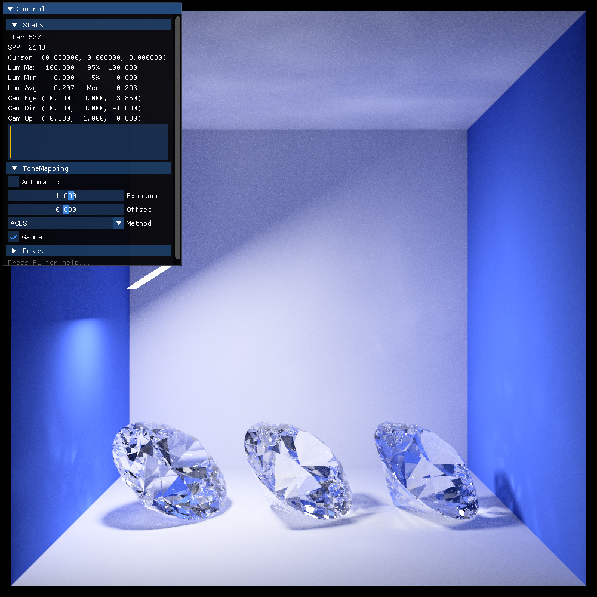

:html_theme.sidebar_secondary.remove:
:html_theme.show_prev_next.disable:

Welcome to the documentation of Ignis!
======================================

**Ignis** is a high-performance raytracer implemented using the Artic frontend of the AnyDSL compiler framework (https://anydsl.github.io/) and based on Rodent (https://github.com/AnyDSL/rodent). The renderer is usable on all three major platforms (Linux, Windows, MacOs).

.. toctree::
   :maxdepth: 1
   :hidden:

   src/getting_started/index
   src/scene/index
   src/python/index