BSDFs
=====

This section contains a list of bsdfs supported by the Ignis renderer.
All number and color parameters can be connected to a texture by referencing it via its name.
If only a channel of the texture is desired, the expression :monosp:`id.channel` can be used, with :monosp:`channel` being r, g or b respectively.

A bsdf is specified in the :monosp:`bsdfs` block with a :monosp:`name` and a :monosp:`type`.
The type has to be one of the bsdfs listed at this section below.

.. code-block:: javascript
    
    {
        // ...
        "bsdfs": [
            // ...
            {"name":"NAME", "type":"TYPE", /* DEPENDS ON TYPE */},
            // ...
        ]
        // ...
    }

.. _bsdf-diffuse:

Smooth diffuse (:monosp:`diffuse`)
----------------------------------

.. objectparameters::

 * - reflectance
   - |color|
   - 0.5
   - Albedo

.. subfigstart::
  
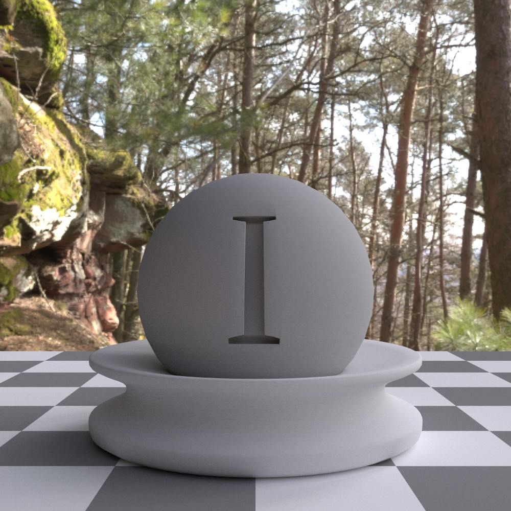

  Diffuse

.. subfigend::
  :width: 0.6
  :label: fig-diffuse

.. _bsdf-roughdiffuse:

Rough diffuse (:monosp:`roughdiffuse`)
--------------------------------------

.. objectparameters::

 * - reflectance
   - |color|
   - 0.5
   - Albedo

.. subfigstart::

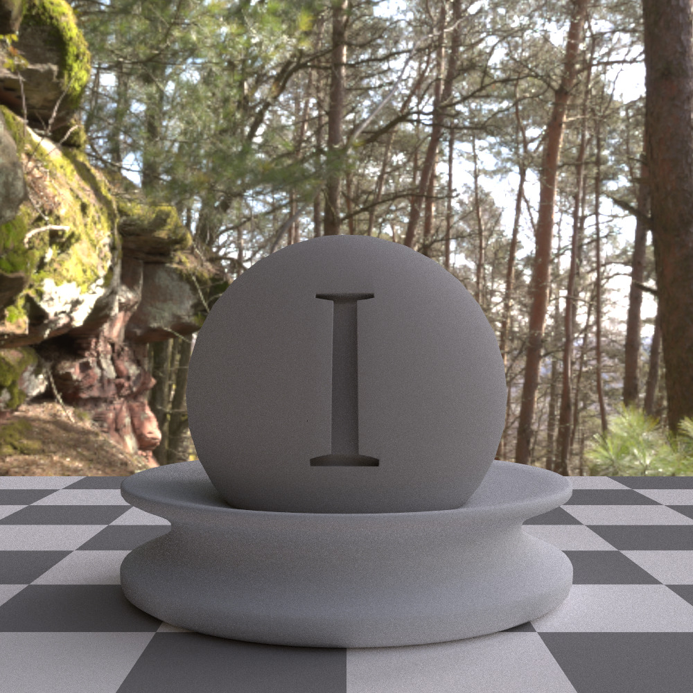
  
  Rough diffuse, also called Oren-Nayar 

.. subfigend::
  :width: 0.6
  :label: fig-rough-diffuse

.. _bsdf-dielectric:

Smooth dielectric (:monosp:`dielectric`)
----------------------------------------

.. objectparameters::

 * - specular_reflectance
   - |color|
   - 1.0
   - TODO
 * - specular_transmittance
   - |color|
   - 1.0
   - TODO
 * - ext_ior, int_ior
   - |number|
   - 1.00027, 1.55
   - TODO
 * - thin
   - |bool|
   - false
   - Thin

.. subfigstart::

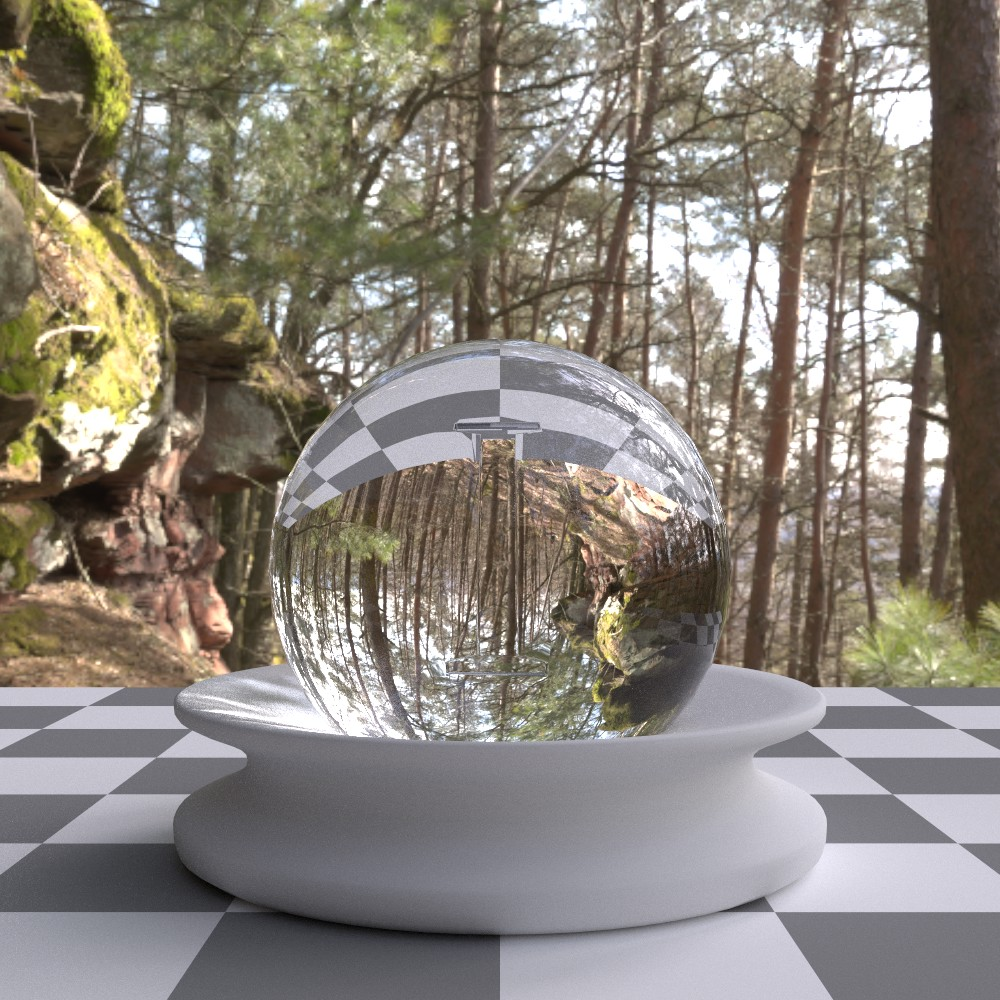
  
  Dielectric

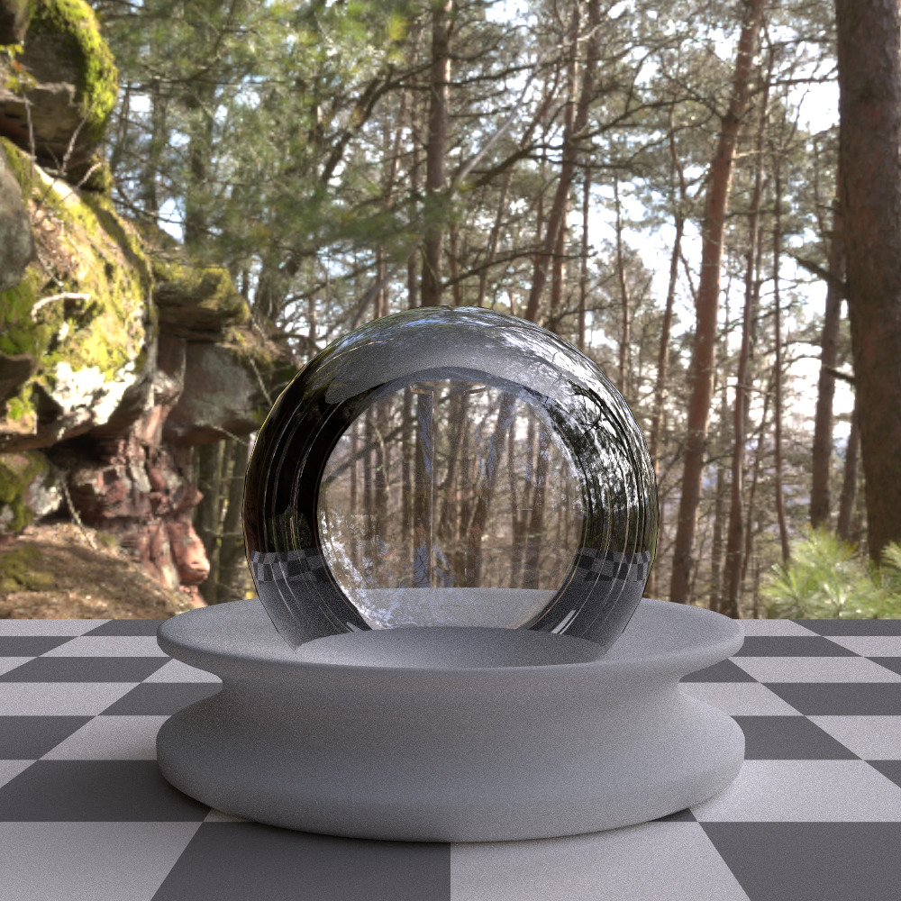
  
  Dielectric with thin approximation 

.. subfigend::
  :width: 0.30
  :label: fig-dielectric 

.. _bsdf-roughdielectric:

Rough dielectric (:monosp:`roughdielectric`)
--------------------------------------------

.. objectparameters::

 * - specular_reflectance
   - |color|
   - 1.0
   - TODO
 * - specular_transmittance
   - |color|
   - 1.0
   - TODO
 * - ext_ior, int_ior
   - |number|
   - 1.00027, 1.55
   - TODO

.. WARNING:: The :monosp:`roughdielectric` is currently not implemented and will fallback to :monosp:`dielectric`

.. _bsdf-mirror:

Perfect smooth mirror (:monosp:`mirror`)
----------------------------------------

.. objectparameters::

 * - specular_reflectance
   - |texture|
   - 1.0
   - TODO

.. subfigstart::

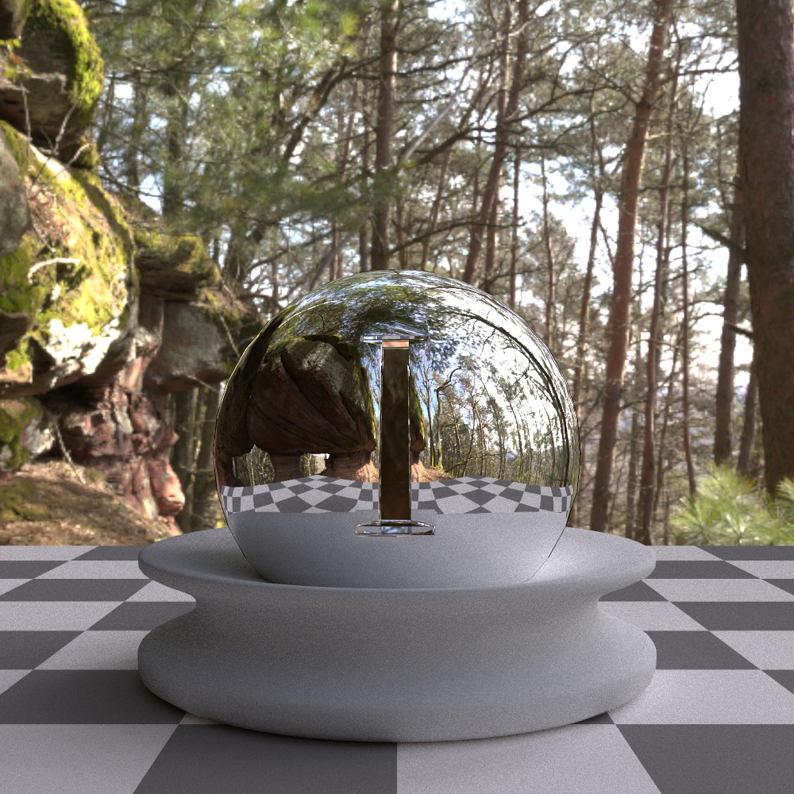
  
  Mirror, or a perfect conductor

.. subfigend::
  :width: 0.6
  :label: fig-mirror

.. _bsdf-conductor:

Smooth conductor (:monosp:`conductor`)
--------------------------------------

.. objectparameters::

 * - eta, k
   - |number|
   - none
   - Real and imaginary components of the material's index of refraction.
 * - specular_reflectance
   - |color|
   - 1.0
   - Optional factor that can be used to modulate the specular reflection component.
     Note that for physical realism, this parameter should never be touched. 

.. subfigstart::

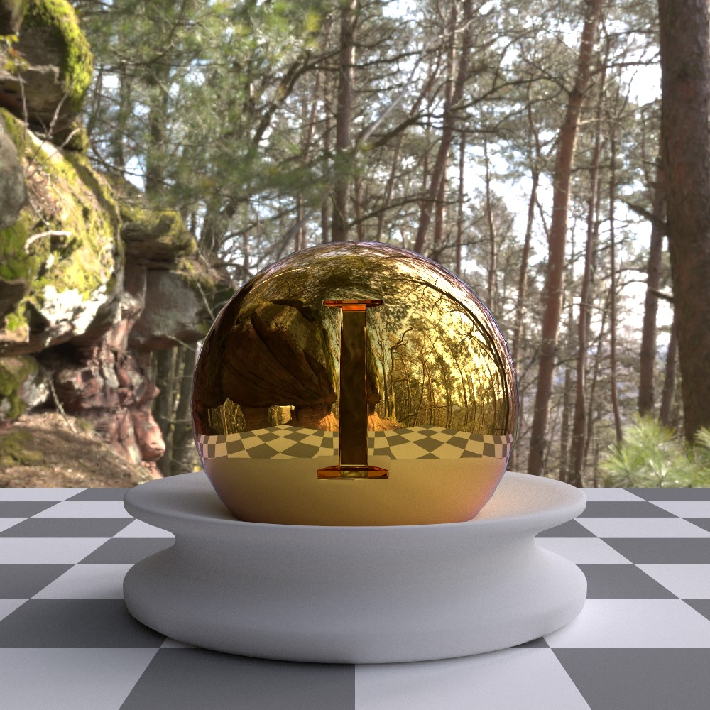
  
  Conductor

.. subfigend::
  :width: 0.6
  :label: fig-conductor

.. _bsdf-roughconductor:

Rough conductor (:monosp:`roughconductor`)
------------------------------------------

.. objectparameters::

 * - eta, k
   - |number|
   - none
   - Real and imaginary components of the material's index of refraction.
 * - specular_reflectance
   - |color|
   - 1.0
   - Optional factor that can be used to modulate the specular reflection component.
     Note that for physical realism, this parameter should never be touched. 
     
.. subfigstart::

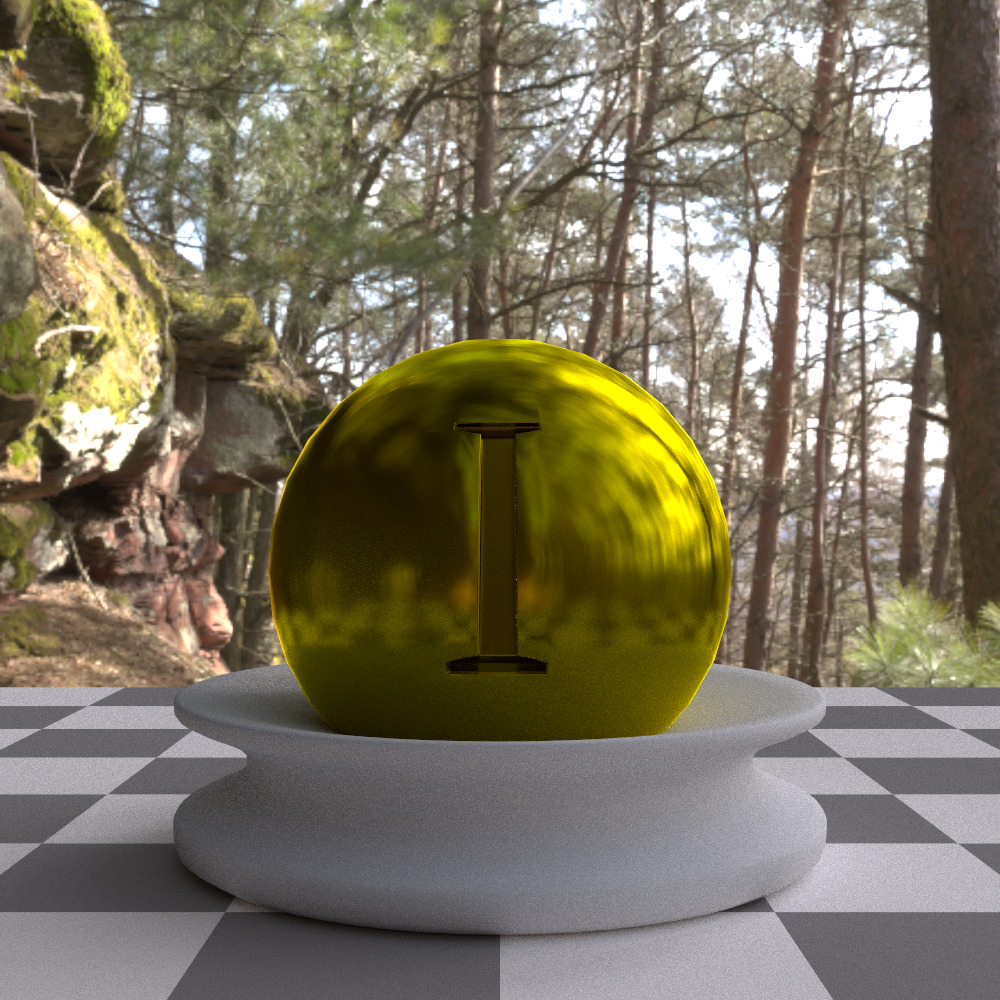
  
  Rough conductor

.. subfigend::
  :width: 0.6
  :label: fig-rough-conductor

.. _bsdf-plastic:

Smooth plastic (:monosp:`plastic`)
----------------------------------

.. objectparameters::

 * - specular_reflectance
   - |color|
   - 1.0
   - TODO
 * - diffuse_reflectance
   - |color|
   - 0.5
   - TODO
 * - ext_ior, int_ior
   - |number|
   - 1.00027, 1.55
   - TODO

.. subfigstart::

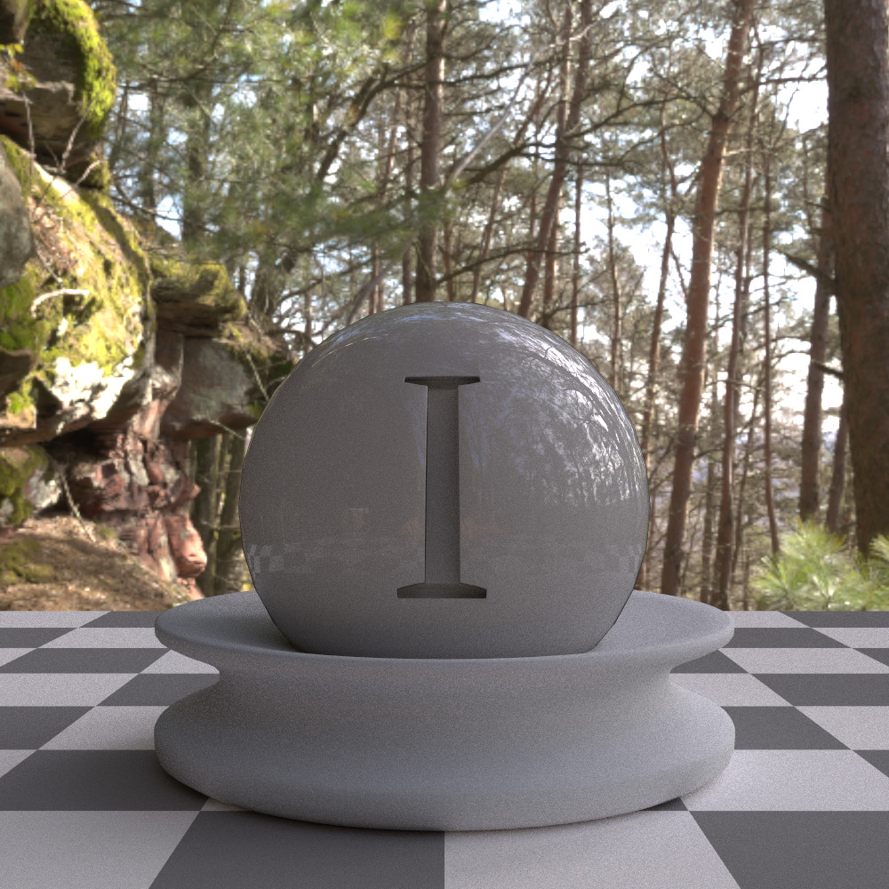
  
  Plastic

.. subfigend::
  :width: 0.6
  :label: fig-plastic

.. _bsdf-roughplastic:

Rough plastic (:monosp:`roughplastic`)
--------------------------------------

.. objectparameters::

 * - specular_reflectance
   - |color|
   - 1.0
   - TODO
 * - diffuse_reflectance
   - |color|
   - 0.5
   - TODO
 * - ext_ior, int_ior
   - |number|
   - 1.00027, 1.55
   - TODO

.. subfigstart::

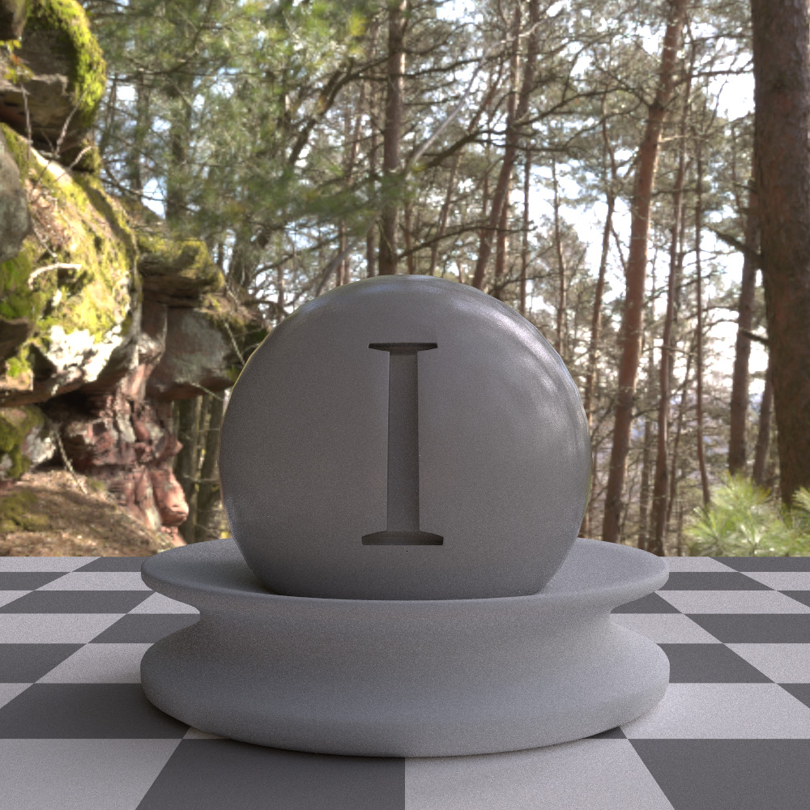
  
  Rough plastic

.. subfigend::
  :width: 0.6
  :label: fig-rough-plastic

.. _bsdf-phong:

Phong (:monosp:`phong`)
-----------------------

.. objectparameters::

 * - specular_reflectance
   - |color|
   - 1.0
   - TODO
 * - exponent
   - |number|
   - 30
   - TODO

.. subfigstart::

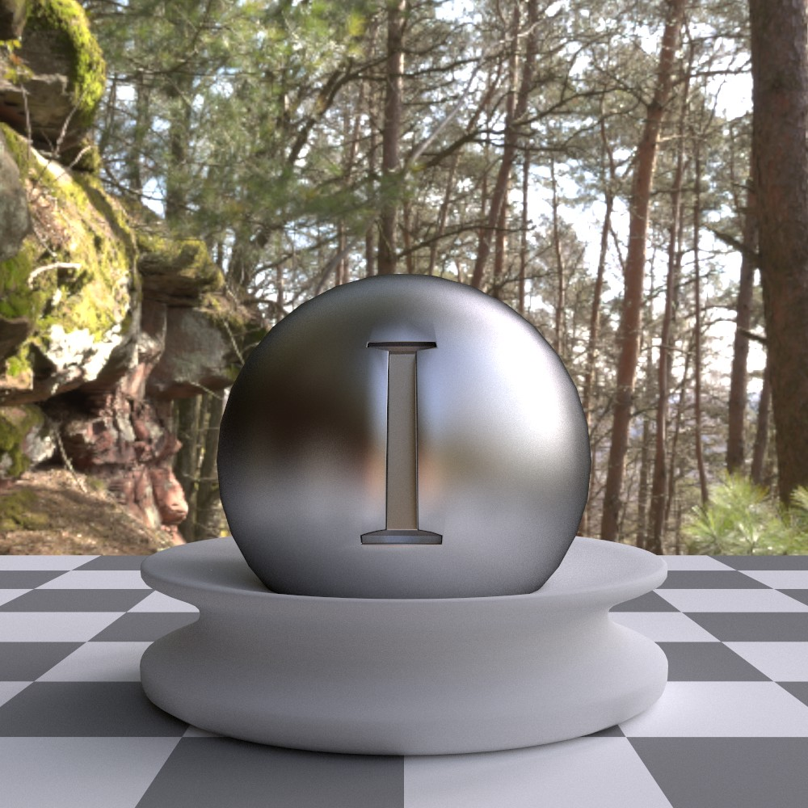
  
  Phong

.. subfigend::
  :width: 0.6
  :label: fig-phong

.. NOTE:: We do not recommend to use this bsdf for new projects, as it disregards energy conversation or other PBR principles

.. _bsdf-disney:

Disney *Principled* (:monosp:`disney`)
--------------------------------------

.. objectparameters::

 * - base_color
   - |color|
   - 1.0
   - TODO
 * - flatness
   - |number|
   - 0.0
   - TODO
 * - metallic
   - |number|
   - 0.0
   - TODO
 * - ior
   - |number|
   - 1.55
   - TODO
 * - specular_tint
   - |number|
   - 0.0
   - TODO
 * - roughness
   - |number|
   - 0.5
   - TODO
 * - anisotropic
   - |number|
   - 0.0
   - TODO
 * - sheen
   - |number|
   - 0.0
   - TODO
 * - sheen_tint
   - |number|
   - 0.0
   - TODO
 * - clearcoat
   - |number|
   - 0.0
   - TODO
 * - clearcoat_gloss
   - |number|
   - 0.0
   - TODO
 * - spec_trans
   - |number|
   - 0.0
   - TODO
 * - relative_ior
   - |number|
   - 1.1
   - TODO
 * - scatter_distance
   - |number|
   - 0.5
   - TODO
 * - diff_trans
   - |number|
   - 0.0
   - TODO
 * - transmittance
   - |number|
   - 0.0
   - TODO

.. subfigstart::

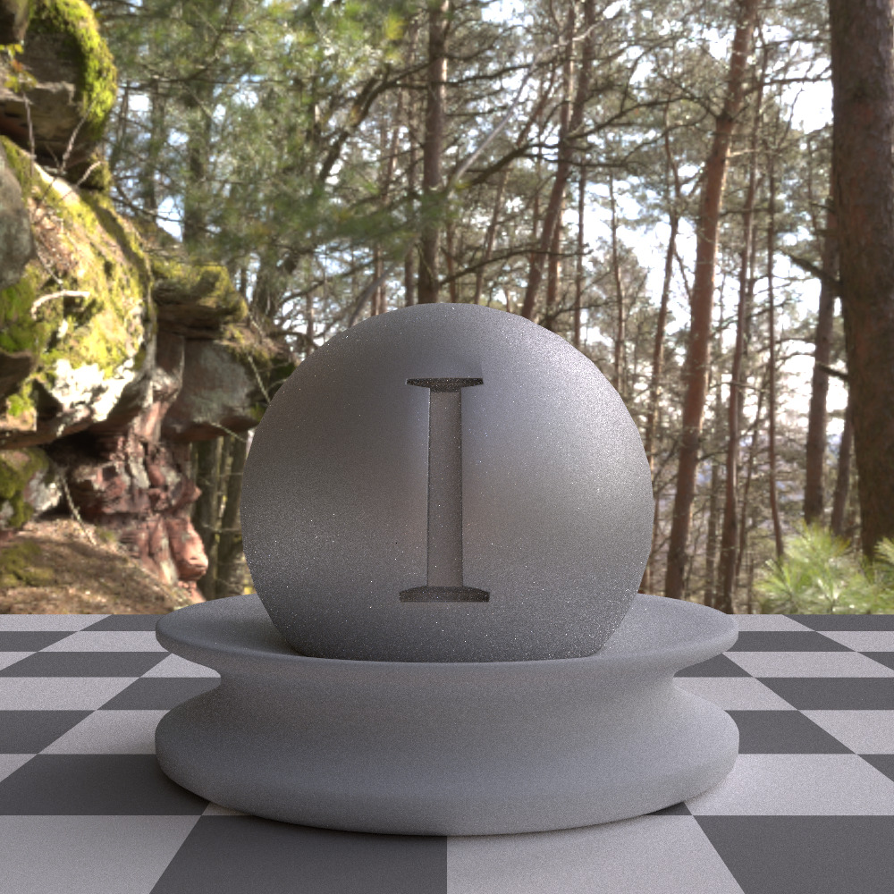
  
  Disney *Principled* 

.. subfigend::
  :width: 0.6
  :label: fig-disney

.. WARNING:: The :monosp:`disney` bsdf is still experimental

.. _bsdf-blend:

Blend (:monosp:`blend`)
-----------------------

.. objectparameters::

 * - first, second
   - |bsdf|
   - None
   - TODO
 * - weight
   - |number|
   - 0.5
   - TODO

.. subfigstart::

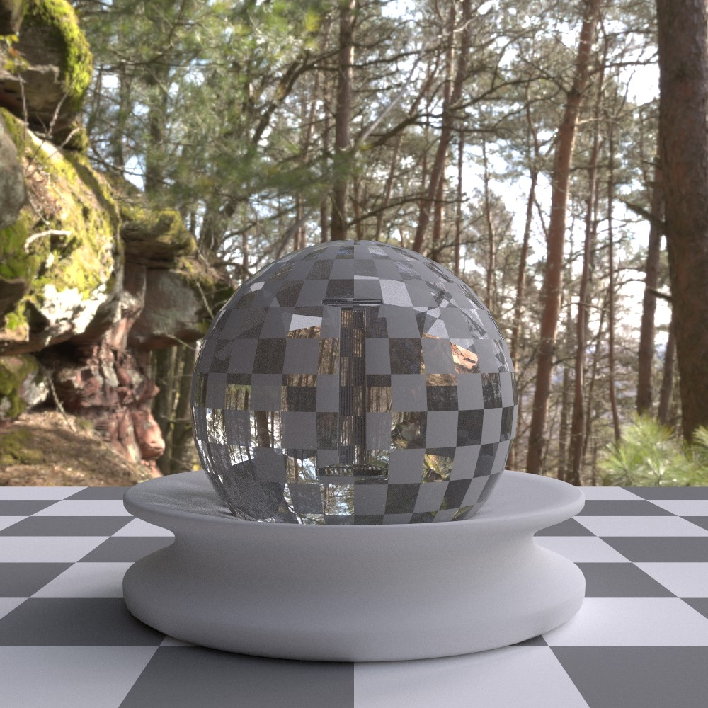
  
  Blend of two bsdfs. One dielectric, one diffuse

.. subfigend::
  :width: 0.6
  :label: fig-blend

.. _bsdf-mask:

Mask (:monosp:`mask`)
---------------------

.. objectparameters::

 * - bsdf
   - |bsdf|
   - None
   - TODO
 * - weight
   - |number|
   - 0.5
   - TODO

.. subfigstart::

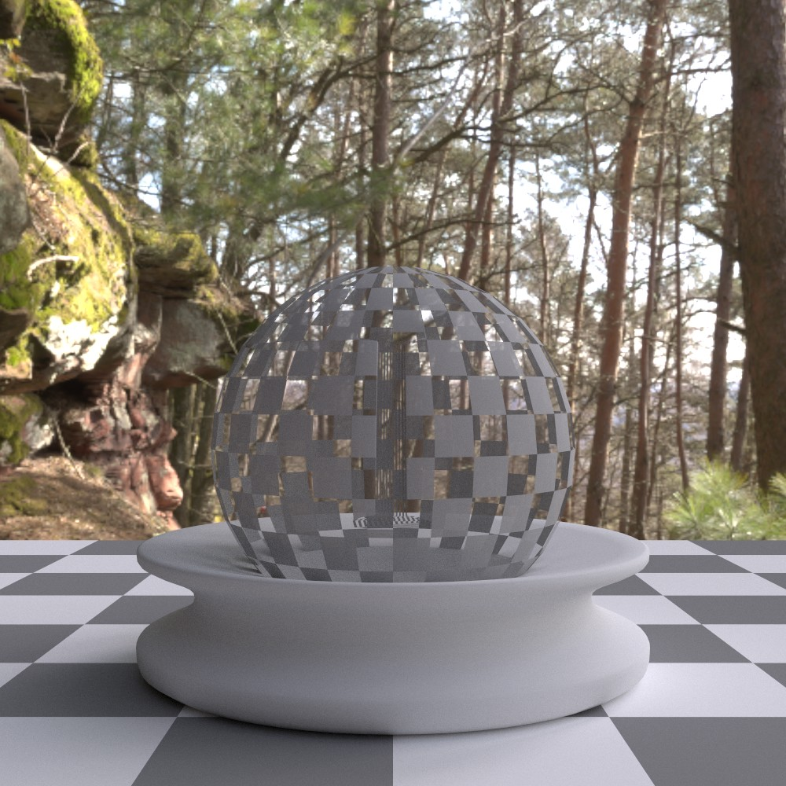
  
  Mask with a uniform weight

.. subfigend::
  :width: 0.6
  :label: fig-mask

.. _bsdf-passthrough:

Passthrough (:monosp:`passthrough`)
-----------------------------------

.. subfigstart::

.. figure::  images/mat_passthrough.jpg
  :width: 90%
  :align: center
  
  Passthrough

.. subfigend::
  :width: 0.6
  :label: fig-passthrough

.. NOTE:: The :monosp:`passthrough` bsdf should be used carefully, as simple techniques like Next-Event Estimation still see the object geometry