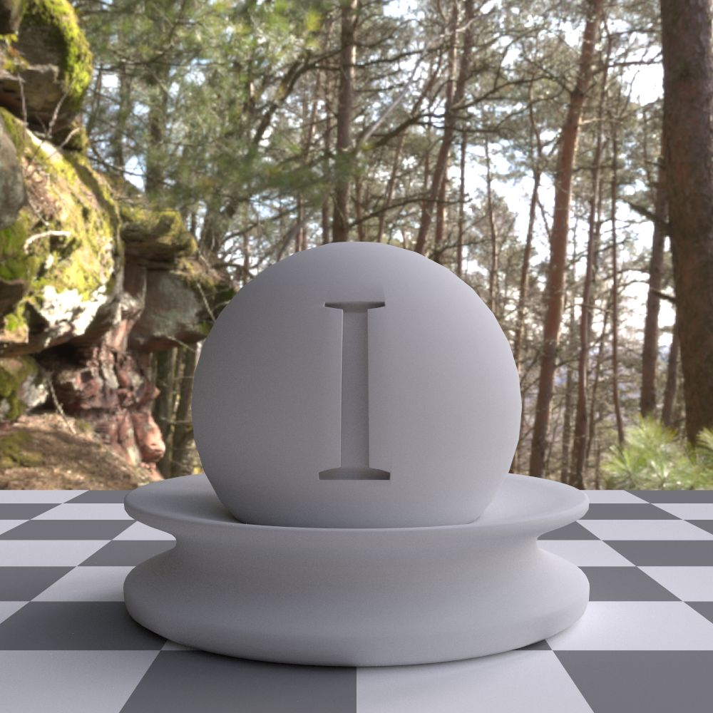
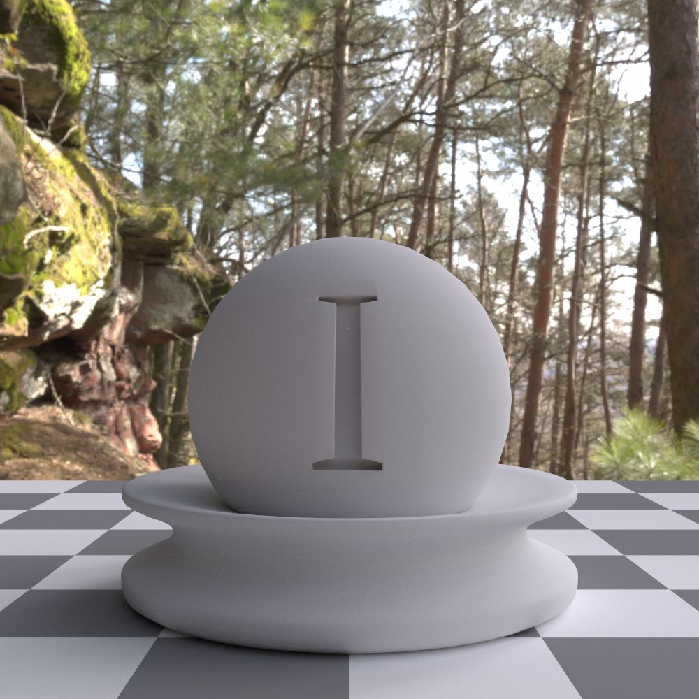
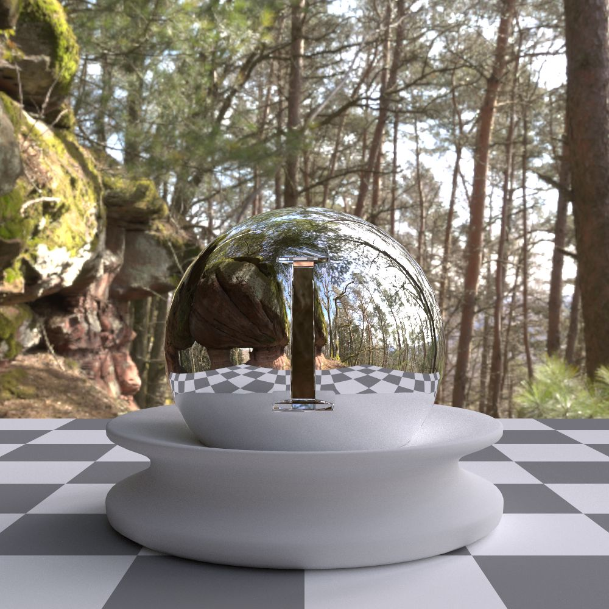
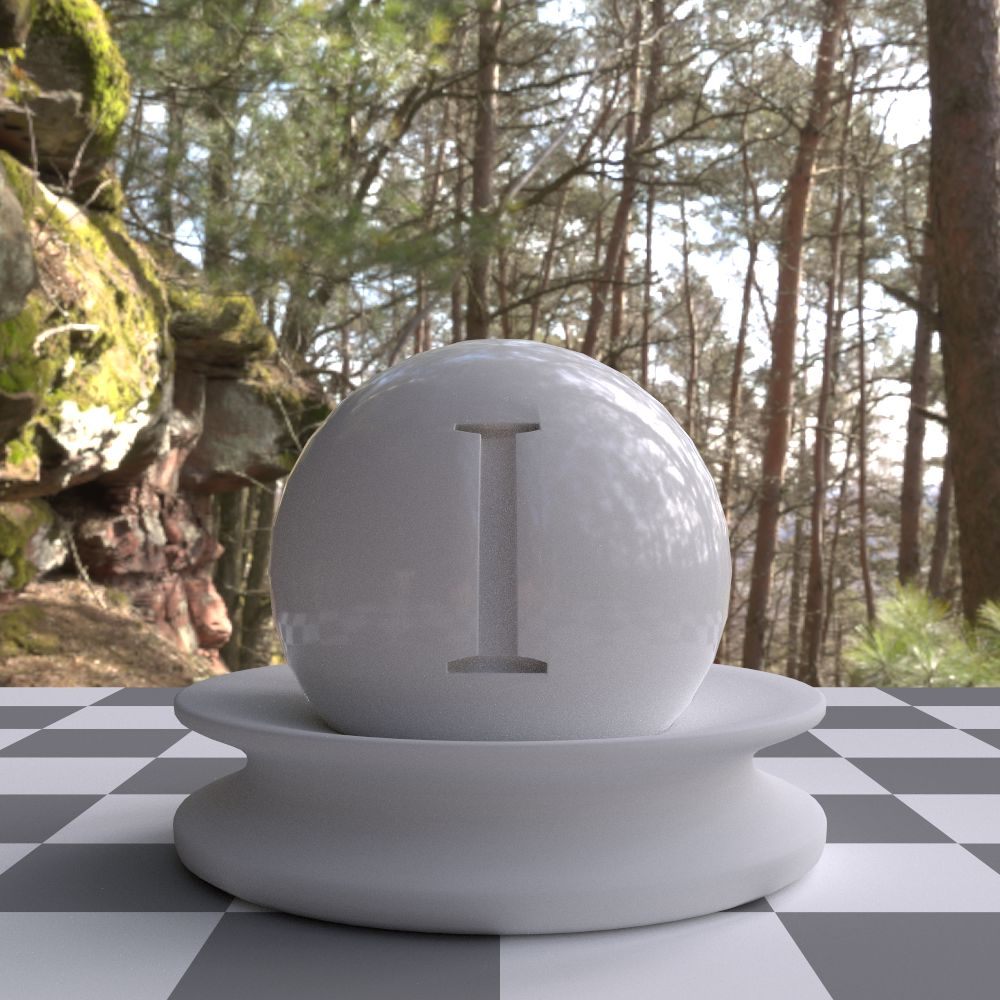
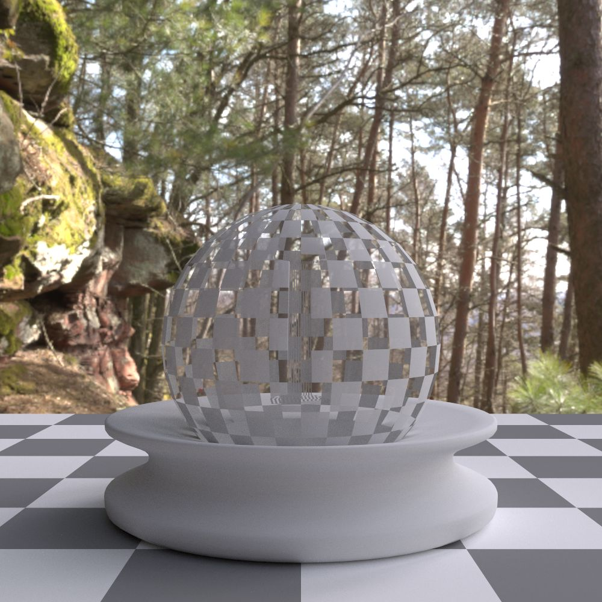
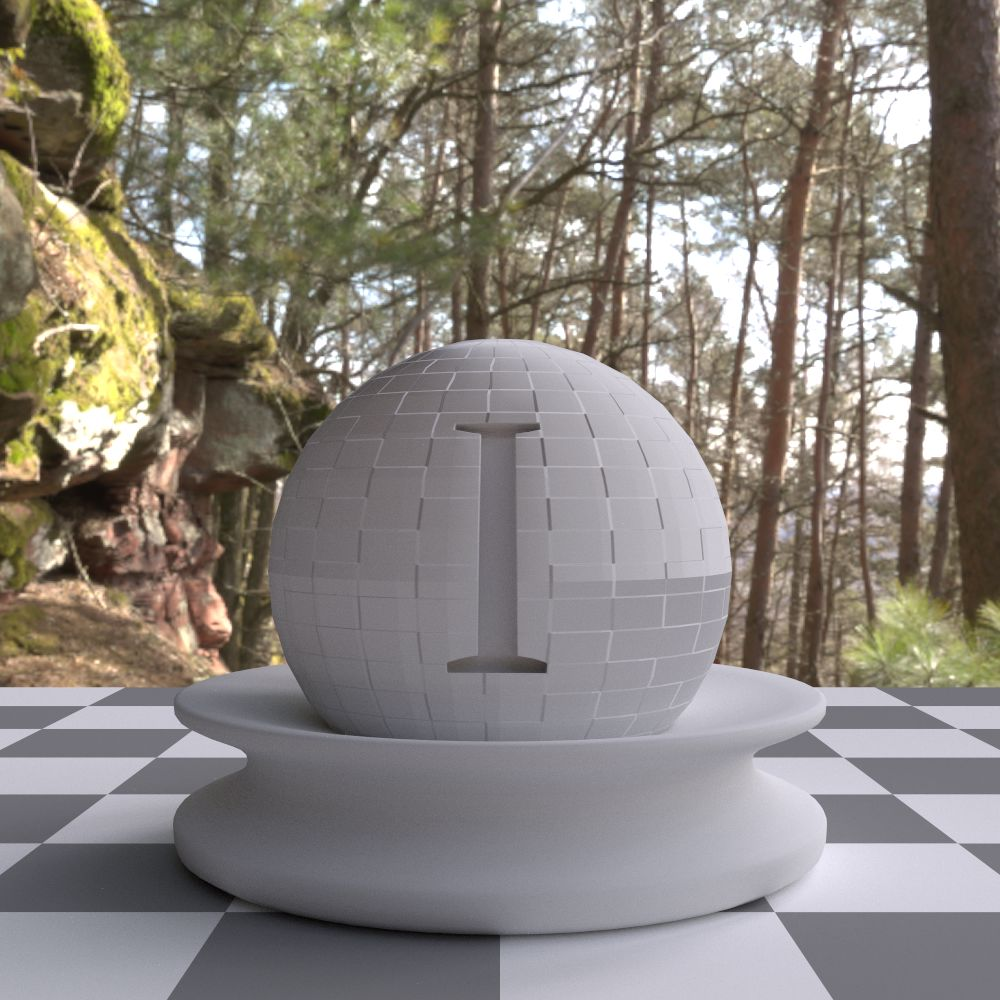

BSDFs
=====

This section contains a list of bsdfs supported by the Ignis renderer.
All number and color parameters can be connected to a shading network or texture via :ref:`PExpr <PExpr>`.

A bsdf is specified in the :monosp:`bsdfs` block with a :monosp:`name` and a :monosp:`type`.
The type has to be one of the bsdfs listed at this section below.

.. code-block:: javascript
    
    {
        // ...
        "bsdfs": [
            // ...
            {"name":"NAME", "type":"TYPE", /* DEPENDS ON TYPE */},
            // ...
        ]
        // ...
    }

.. _bsdf-diffuse:

Smooth diffuse (:monosp:`diffuse`)
----------------------------------

.. objectparameters::

  * - reflectance
    - |color|
    - :code:`0.8`
    - Yes
    - Albedo

.. subfigstart::
  

  Diffuse

.. subfigend::
  :width: 0.6
  :label: fig-diffuse

.. _bsdf-roughdiffuse:

Rough diffuse (:monosp:`roughdiffuse`)
--------------------------------------

.. objectparameters::

  * - reflectance
    - |color|
    - :code:`0.8`
    - Yes
    - Albedo

  * - alpha
    - |number|
    - :code:`0`
    - Yes
    - Isotropic roughness.

.. subfigstart::

  
  Rough diffuse, also called Oren-Nayar 

.. subfigend::
  :width: 0.6
  :label: fig-rough-diffuse

.. _bsdf-dielectric:

Smooth dielectric (:monosp:`dielectric`)
----------------------------------------

.. objectparameters::

  * - specular_reflectance
    - |color|
    - :code:`1.0`
    - Yes
    - TODO
  * - specular_transmittance
    - |color|
    - :code:`1.0`
    - Yes
    - TODO
  * - ext_ior, int_ior
    - |number|
    - ~vacuum, ~bk7
    - Yes
    - Specifies exterior and interior index of refraction.
  * - ext_ior_material, int_ior_material
    - |string|
    - *None*, *None*
    - No
    - Has to be one of the available presets listed :ref:`here <bsdf-dielectric-list>`.
  * - thin
    - |bool|
    - |false|
    - No
    - True if the glass should be treated as a thin interface. :paramtype:`int_ior` will be always the inside of the thin surface, regardless of the direction of the surface normal.

.. subfigstart::

.. subfigure::  images/bsdf_dielectric.jpg
  :align: center
  
  Dielectric

.. subfigure::  images/bsdf_thindielectric.jpg
  :align: center
  
  Dielectric with thin approximation 

.. subfigend::
  :label: fig-dielectric 

.. _bsdf-roughdielectric:

Rough dielectric (:monosp:`roughdielectric`)
--------------------------------------------

.. objectparameters::

  * - specular_reflectance
    - |color|
    - :code:`1.0`
    - Yes
    - TODO
  * - specular_transmittance
    - |color|
    - :code:`1.0`
    - Yes
    - TODO
  * - ext_ior, int_ior
    - |number|
    - ~vacuum, ~bk7 
    - Yes  
    - Specifies exterior and interior index of refraction.
  * - ext_ior_material, int_ior_material
    - |string|
    - *None*, *None*
    - No
    - Has to be one of the available presets listed :ref:`here <bsdf-dielectric-list>`.
  * - alpha_u, alpha_v
    - |number|
    - :code:`0.1`, :code:`0.1`
    - Yes
    - Roughness terms. Can be specified isotropic using :paramtype:`alpha` as well. 

.. subfigstart::

.. figure::  images/bsdf_roughdielectric.jpg
  :width: 90%
  :align: center
  
  Rough dielectric

.. subfigend::
  :width: 0.6
  :label: fig-rough-dielectric

.. _bsdf-mirror:

Perfect smooth mirror (:monosp:`mirror`)
----------------------------------------

.. objectparameters::

  * - specular_reflectance
    - |texture|
    - :code:`1.0`
    - Yes
    - TODO

.. subfigstart::

  
  Mirror, or a perfect conductor

.. subfigend::
  :width: 0.6
  :label: fig-mirror

.. _bsdf-conductor:

Smooth conductor (:monosp:`conductor`)
--------------------------------------

.. objectparameters::

  * - eta, k
    - |color|
    - ~Perfect mirror
    - Yes
    - Real and imaginary components of the material's index of refraction.
  * - material
    - |string|
    - *None*
    - No
    - Instead of eta, k a material name can be specified. Available presets are listed :ref:`here <bsdf-conductor-list>`.
  * - specular_reflectance
    - |color|
    - :code:`1.0`
    - Yes
    - Optional factor that can be used to modulate the specular reflection component.
      Note that for physical realism, this parameter should never be touched. 

.. subfigstart::

.. figure::  images/bsdf_conductor.jpg
  :width: 90%
  :align: center
  
  Gold conductor

.. subfigend::
  :width: 0.6
  :label: fig-conductor

.. _bsdf-roughconductor:

Rough conductor (:monosp:`roughconductor`)
------------------------------------------

.. objectparameters::

  * - eta, k
    - |color|
    - ~Gold
    - Yes
    - Real and imaginary components of the material's index of refraction.
  * - material
    - |string|
    - *None*
    - No
    - Instead of eta, k a material name can be specified. Available presets are listed :ref:`here <bsdf-conductor-list>`.
  * - specular_reflectance
    - |color|
    - :code:`1.0`
    - Yes
    - Optional factor that can be used to modulate the specular reflection component.
      Note that for physical realism, this parameter should never be touched. 
  * - alpha_u, alpha_v
    - |number|
    - :code:`0.1`, :code:`0.1`
    - Yes
    - Roughness terms. Can be specified isotropic using :paramtype:`alpha` as well.
   
.. subfigstart::

.. figure::  images/bsdf_roughconductor.jpg
  :width: 90%
  :align: center
  
  Rough gold conductor

.. subfigend::
  :width: 0.6
  :label: fig-rough-conductor

.. _bsdf-plastic:

Smooth plastic (:monosp:`plastic`)
----------------------------------

.. objectparameters::

  * - specular_reflectance
    - |color|
    - :code:`1.0`
    - Yes
    - TODO
  * - diffuse_reflectance
    - |color|
    - :code:`0.8`
    - Yes
    - TODO
  * - ext_ior, int_ior
    - |number|
    - ~vacuum, ~bk7
    - Yes   
    - Specifies exterior and interior index of refraction.
  * - ext_ior_material, int_ior_material
    - |string|
    - *None*, *None*
    - No
    - Has to be one of the available presets listed :ref:`here <bsdf-dielectric-list>`.

.. subfigstart::

.. figure::  images/bsdf_plastic.jpg
  :width: 90%
  :align: center
  
  Plastic

.. subfigend::
  :width: 0.6
  :label: fig-plastic

.. _bsdf-roughplastic:

Rough plastic (:monosp:`roughplastic`)
--------------------------------------

.. objectparameters::

  * - specular_reflectance
    - |color|
    - :code:`1.0`
    - Yes
    - TODO
  * - diffuse_reflectance
    - |color|
    - :code:`0.8`
    - Yes
    - TODO
  * - ext_ior, int_ior
    - |number| 
    - ~vacuum, ~bk7   
    - Yes
    - Specifies exterior and interior index of refraction.
  * - ext_ior_material, int_ior_material
    - |string|
    - *None*, *None*
    - No
    - Has to be one of the available presets listed :ref:`here <bsdf-dielectric-list>`.
  * - alpha_u, alpha_v
    - |number|
    - :code:`0.1`, :code:`0.1`
    - Yes
    - Roughness terms. Can be specified isotropic using :paramtype:`alpha` as well. 

.. subfigstart::

.. figure::  images/bsdf_roughplastic.jpg
  :width: 90%
  :align: center
  
  Rough plastic

.. subfigend::
  :width: 0.6
  :label: fig-rough-plastic

.. _bsdf-phong:

Phong (:monosp:`phong`)
-----------------------

.. objectparameters::

  * - specular_reflectance
    - |color|
    - :code:`1.0`
    - Yes
    - TODO
  * - exponent
    - |number|
    - :code:`30`
    - Yes
    - TODO

.. subfigstart::

.. figure::  images/bsdf_phong.jpg
  :width: 90%
  :align: center
  
  Phong

.. subfigend::
  :width: 0.6
  :label: fig-phong

.. NOTE:: It is not recommended to use this bsdf for new projects as it disregards some PBR principles and is only included for legacy purposes.

.. _bsdf-principled:

Disney *Principled* (:monosp:`principled`)
------------------------------------------

.. objectparameters::

  * - base_color
    - |color|
    - :code:`0.8`
    - Yes
    - TODO
  * - metallic
    - |number|
    - :code:`0.0`
    - Yes
    - TODO
  * - roughness
    - |number|
    - :code:`0.5`
    - Yes
    - TODO
  * - anisotropic
    - |number|
    - :code:`0.0`
    - Yes
    - TODO
  * - ior
    - |number|
    - ~bk7   
    - Yes
    - Specifies index of refraction.
  * - ior_material
    - |string|
    - *None*
    - No
    - Has to be one of the available presets listed :ref:`here <bsdf-dielectric-list>`.
  * - thin
    - |bool|
    - |false|
    - No
    - TODO
  * - flatness
    - |number|
    - :code:`0.0`
    - Yes
    - TODO
  * - specular_transmission
    - |number|
    - :code:`0.0`
    - Yes
    - TODO
  * - specular_tint
    - |number|
    - :code:`0.0`
    - Yes
    - TODO
  * - sheen
    - |number|
    - :code:`0.0`
    - Yes
    - TODO
  * - sheen_tint
    - |number|
    - :code:`0.0`
    - Yes
    - TODO
  * - clearcoat
    - |number|
    - :code:`0.0`
    - Yes
    - TODO
  * - clearcoat_gloss
    - |number|
    - :code:`0.0`
    - Yes
    - TODO
  * - clearcoat_top_only
    - |bool|
    - |true|
    - No
    - |true| if clearcoat should only be applied to the front side of the surface only.
  * - clearcoat_roughness
    - |number|
    - :code:`0.1`
    - Yes
    - TODO
  * - diffuse_transmission
    - |number|
    - :code:`0.0`
    - Yes
    - TODO

.. subfigstart::

  
  Disney *Principled* 

.. subfigend::
  :width: 0.6
  :label: fig-principled

.. _bsdf-blend:

Blend (:monosp:`blend`)
-----------------------

.. objectparameters::

  * - first, second
    - |bsdf|
    - *None*
    - No
    - TODO
  * - weight
    - |number|
    - :code:`0.5`
    - Yes
    - TODO

.. subfigstart::

.. figure::  images/bsdf_blend.jpg
  :width: 90%
  :align: center
  
  Blend of two bsdfs. One dielectric, one diffuse

.. subfigend::
  :width: 0.6
  :label: fig-blend

.. _bsdf-mask:

Mask (:monosp:`mask`)
---------------------

.. objectparameters::

  * - bsdf
    - |bsdf|
    - *None*
    - No
    - TODO
  * - weight
    - |number|
    - :code:`0.5`
    - Yes
    - TODO
  * - inverted
    - |bool|
    - |false|
    - No
    - TODO

.. subfigstart::

  
  Mask with a uniform weight

.. subfigend::
  :width: 0.6
  :label: fig-mask

.. _bsdf-cutoff:

Cutoff (:monosp:`cutoff`)
-------------------------

.. objectparameters::

  * - bsdf
    - |bsdf|
    - *None*
    - No
    - TODO
  * - weight
    - |number|
    - :code:`0.5`
    - Yes
    - TODO
  * - cutoff
    - |number|
    - :code:`0.5`
    - Yes
    - TODO
  * - inverted
    - |bool|
    - |false|
    - No
    - TODO

.. subfigstart::

.. figure::  images/bsdf_cutoff.jpg
  :width: 90%
  :align: center
  
  Cutoff with a uniform weight

.. subfigend::
  :width: 0.6
  :label: fig-cutoff

.. _bsdf-passthrough:

Passthrough (:monosp:`passthrough`)
-----------------------------------

.. subfigstart::

.. figure::  images/bsdf_passthrough.jpg
  :width: 90%
  :align: center
  
  Passthrough

.. subfigend::
  :width: 0.6
  :label: fig-passthrough

.. WARNING:: The :monosp:`passthrough` bsdf should be used carefully, as simple techniques like Next-Event Estimation still see the object geometry.

.. _bsdf-normalmap:

Normal mapping (:monosp:`normalmap`)
------------------------------------

.. objectparameters::

  * - bsdf
    - |bsdf|
    - *None*
    - No
    - TODO
  * - map
    - |color|
    - :code:`1`
    - Yes
    - Usually a texture used for normal mapping.
  * - strength
    - |number|
    - :code:`1`
    - Yes
    - TODO

.. subfigstart::

  
  Normal mapping

.. subfigend::
  :width: 0.6
  :label: fig-normalmap

.. _bsdf-bumpmap:

Bump mapping (:monosp:`bumpmap`)
--------------------------------

.. objectparameters::

  * - bsdf
    - |bsdf|
    - *None*
    - No
    - TODO
  * - map
    - |texture|
    - *None*
    - Yes
    - A grayscale texture used for texture mapping.
  * - strength
    - |number|
    - :code:`1`
    - Yes
    - TODO

.. subfigstart::

.. figure::  images/bsdf_bumpmap.jpg
  :width: 90%
  :align: center
  
  Bump mapping

.. subfigend::
  :width: 0.6
  :label: fig-bumpmap

.. _bsdf-transform:

Transform (:monosp:`transform`)
-------------------------------

.. objectparameters::

  * - bsdf
    - |bsdf|
    - *None*
    - No
    - Bsdf the normal transformation will be applied to.
  * - normal
    - |vector|
    - :code:`(0,0,1)`
    - Yes
    - Normal to use instead of the callee normal (e.g., surface normal).
  * - tangent
    - |vector|
    - *None*
    - Yes
    - Tangent to use instead of the callee tangent (e.g., surface tangent). Will be calculated from the normal parameter if not set.

.. subfigstart::

.. figure::  images/bsdf_transform.jpg
  :width: 90%
  :align: center
  
  Normal transformed by a PExpr to mimic a normal map

.. subfigend::
  :width: 0.6
  :label: fig-transform

.. _bsdf-djmeasured:

Dupuy & Jakob measured materials (:monosp:`djmeasured`)
-------------------------------------------------------

.. objectparameters::

  * - filename
    - |string|
    - *None*
    - No
    - Path to a valid brdf.
  * - tint
    - |color|
    - :code:`1`
    - Yes
    - Tint.

.. subfigstart::

.. figure::  images/bsdf_djmeasured.jpg
  :width: 90%
  :align: center
  
  Dupuy & Jakob based measured material. More information and measured data available at https://rgl.epfl.ch/materials

.. subfigend::
  :width: 0.6
  :label: fig-djmeasured

.. _bsdf-klems:

Klems (:monosp:`klems`)
-----------------------

.. objectparameters::

  * - filename
    - |string|
    - *None*
    - No
    - Path to a valid windows xml specifying a klems bsdf.
  * - base_color
    - |color|
    - :code:`1`
    - Yes
    - Tint.
  * - up
    - |vector|
    - :code:`(0, 0, 1)`
    - Yes
    - Up vector

.. WARNING:: The :monosp:`klems` bsdf is still experimental and has some issues.

.. _bsdf-tensortree:

TensorTree (:monosp:`tensortree`)
---------------------------------

.. objectparameters::

  * - filename
    - |string|
    - *None*
    - No
    - Path to a valid windows xml specifying a tensortree bsdf.
  * - base_color
    - |color|
    - :code:`1`
    - Yes
    - Tint.
  * - up
    - |vector|
    - :code:`(0, 0, 1)`
    - Yes
    - Up vector

.. _bsdf-dielectric-list:

List of preset index of refractions
-----------------------------------

Currently the following materials are available as presets:

* **vacuum**
* **bk7**
* **glass** `same as bk7`
* **helium**
* **hydrogen**
* **air**
* **water**
* **ethanol**
* **diamond**
* **polypropylene**

.. _bsdf-conductor-list:

List of preset conductors
-------------------------

Currently the following materials are available as presets:

* **aluminum**
* **brass**
* **copper**
* **gold**
* **iron**
* **lead**
* **mercury**
* **platinum**
* **silver**
* **titanium**
* **none** `~ a perfect mirror`