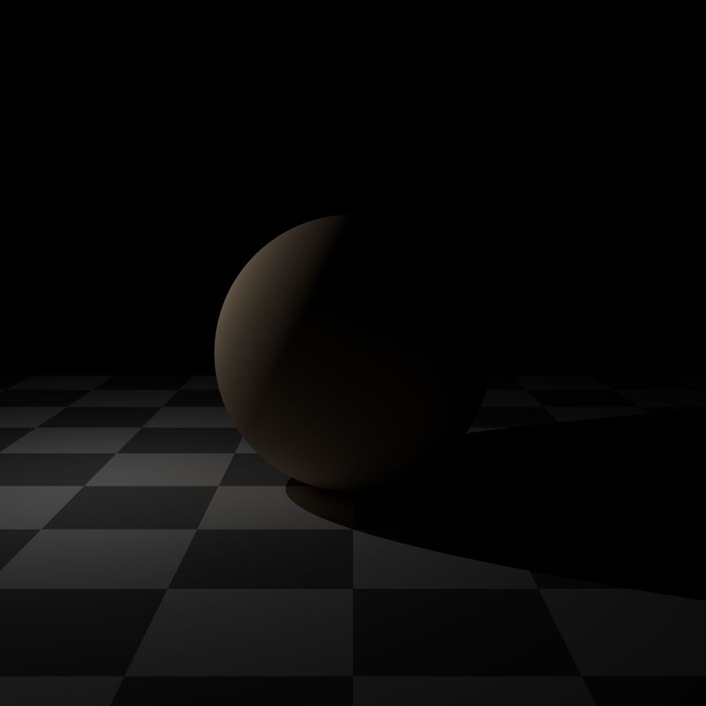
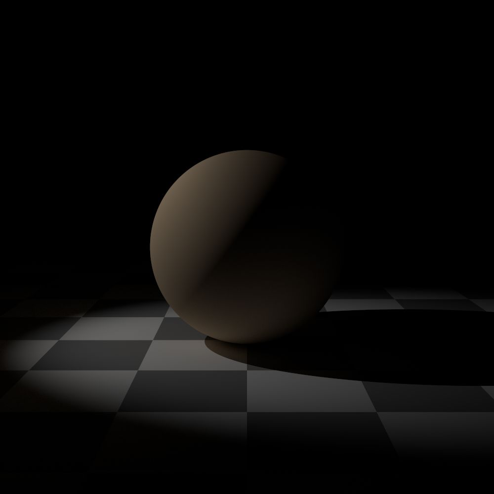
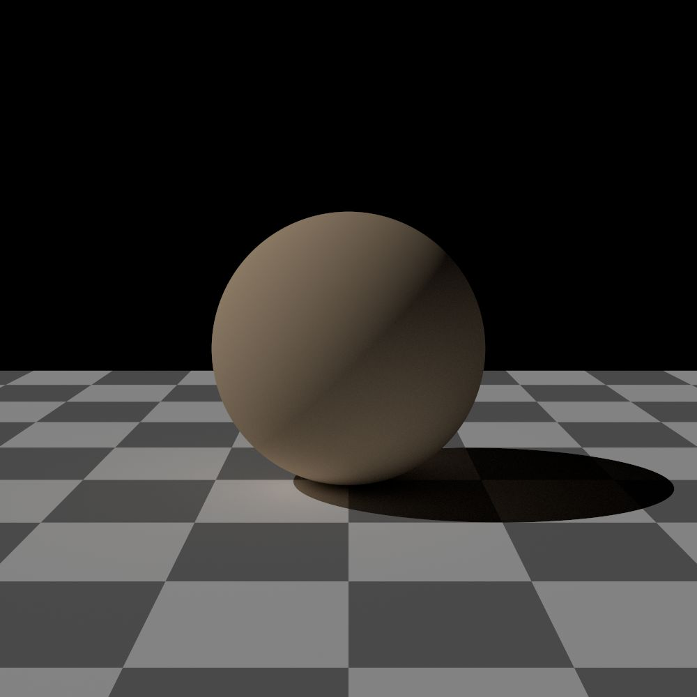
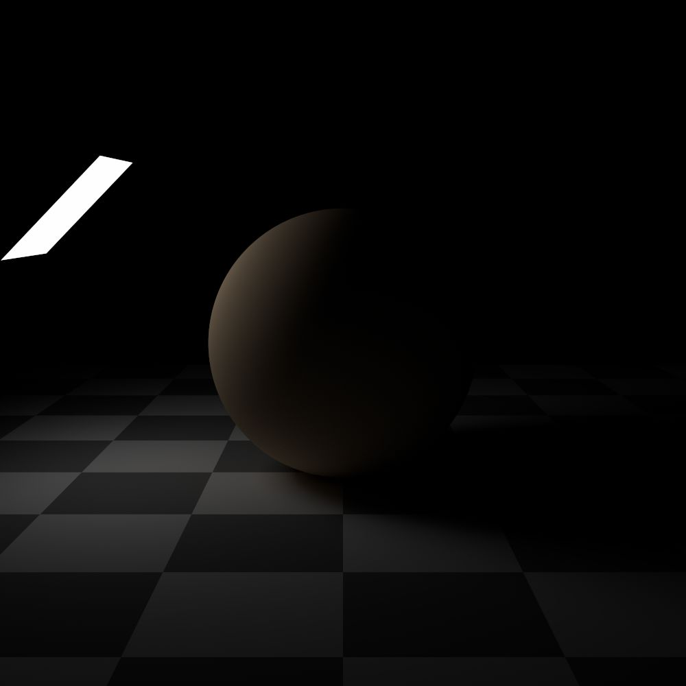
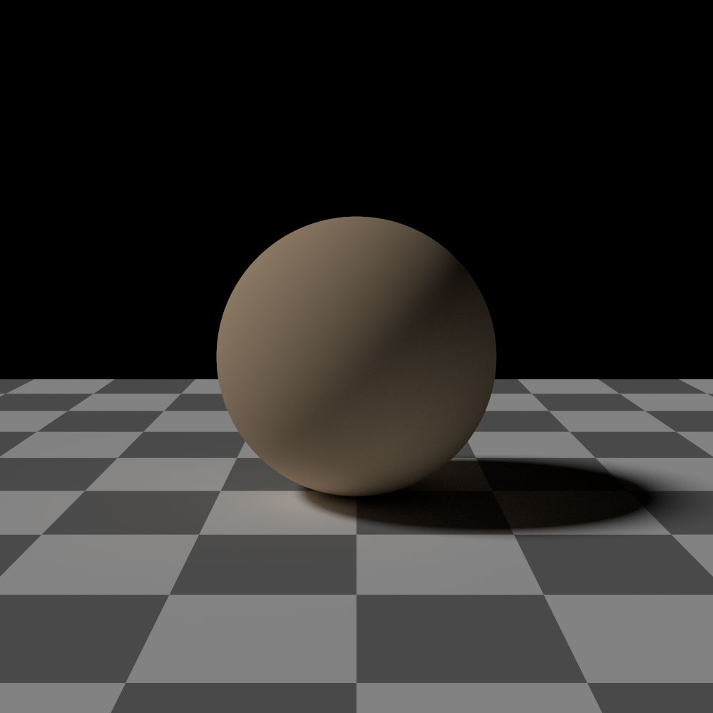
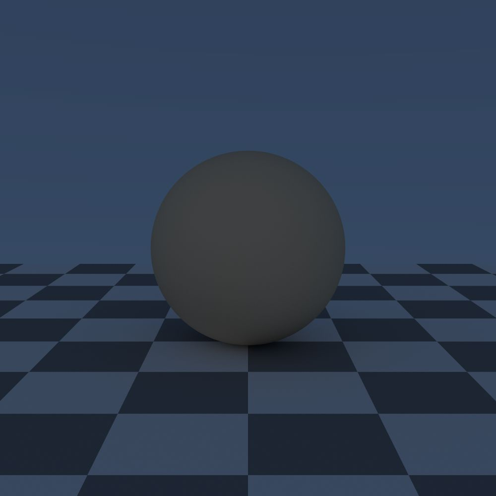
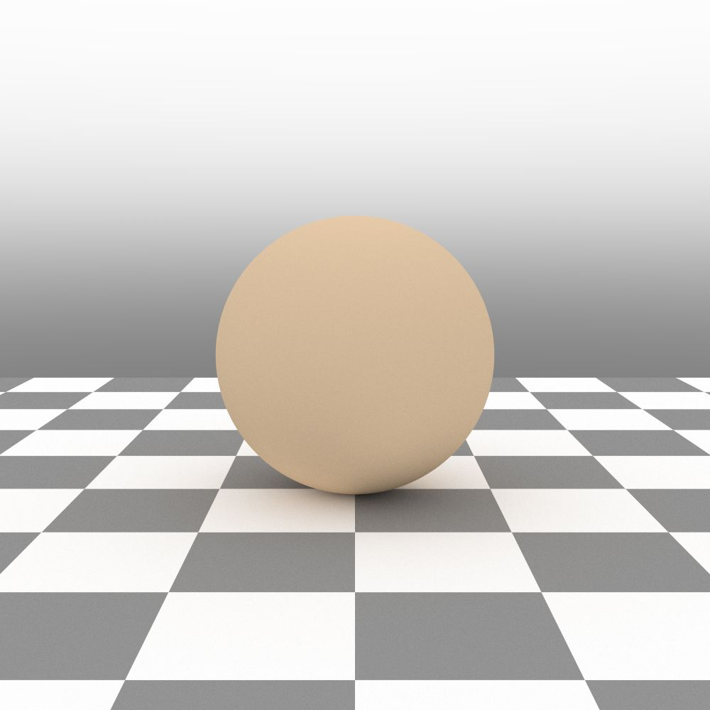
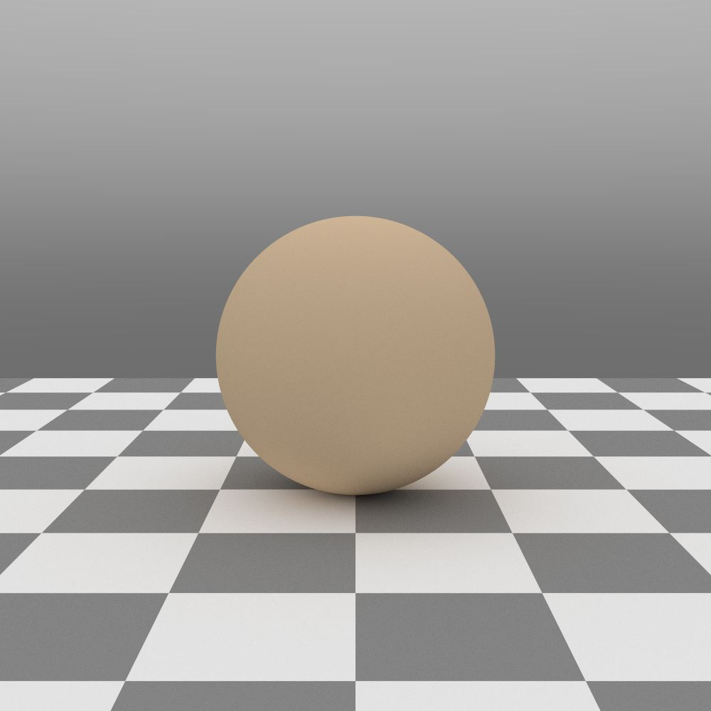
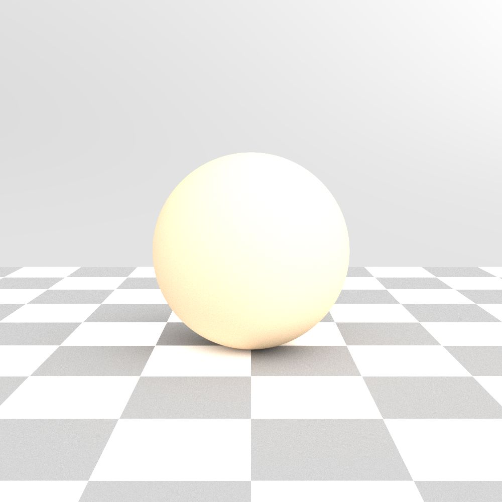
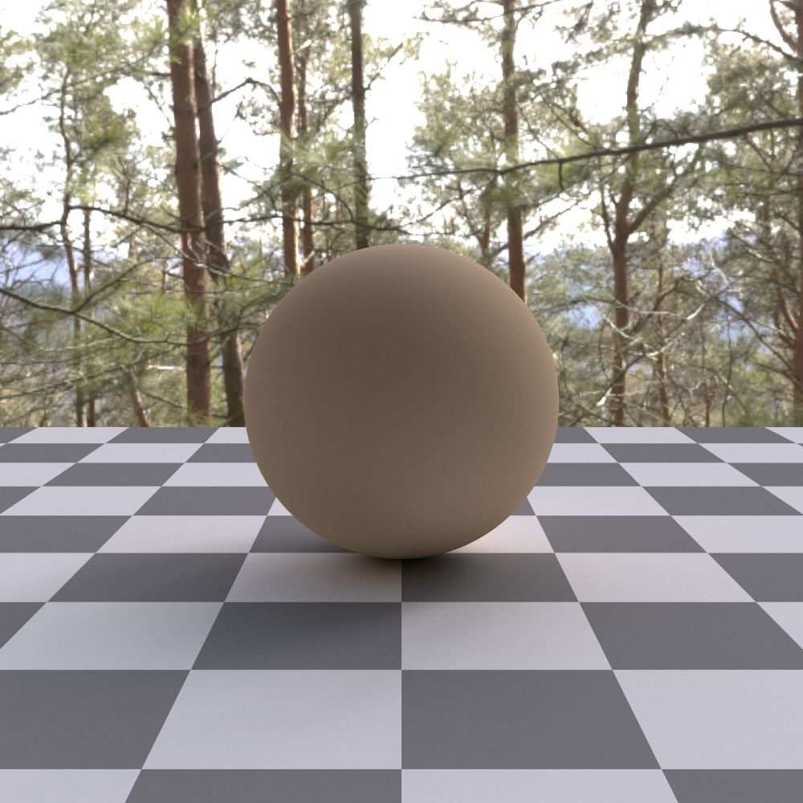

Lights
======

Several light and sky models are contained inside the Ignis rendering framework.
Most number and color parameters can be connected to a shading network or texture via :ref:`PExpr <PExpr>`.

A light is specified in the :monosp:`lights` block with a :monosp:`name` and a :monosp:`type`.
The type has to be one of the lights listed at this section below.

.. code-block:: javascript
    
    {
        // ...
        "lights": [
            // ...
            {"name":"NAME", "type":"TYPE", /* DEPENDS ON TYPE */},
            // ...
        ]
        // ...
    }

.. NOTE:: The interface with PExpr is still experimental and will be further improved in the future. 

Point Light (:monosp:`point`)
---------------------------------------------

.. objectparameters::

  * - position
    - |vector|
    - :code:`(0,0,0)`
    - No
    - Position of the point light.
  * - intensity
    - |color|
    - :code:`1`
    - Yes
    - Intensity of the point light given in radiometric [W/sr] or photometric [lm/sr] units. Can not be specified with :paramtype:`power`.
  * - power
    - |color|
    - *None*
    - Yes
    - Power of the point light given in radiometric [W] or photometric [lm] units. Can not be specified with :paramtype:`intensity`.

.. subfigstart::
  

  Point light 

.. subfigend::
  :width: 0.6
  :label: fig-point-light

Spot Light (:monosp:`spot`)
---------------------------------------------

.. objectparameters::

  * - cutoff
    - |number|
    - :code:`30`
    - No
    - Cutoff angle in degree. Greater angles will be completely black.
  * - falloff
    - |number|
    - :code:`20`
    - No
    - Falloff angle in degree. Greater angles will smoothly falloff towards the cutoff angle. Falloff angle should be less or equal to the cutoff angle.
  * - position
    - |vector|
    - :code:`(0,0,0)`
    - No
    - Position of the light.
  * - direction
    - |vector|
    - :code:`(0,0,1)`
    - No
    - Direction of the light towards the scene.
  * - elevation, azimuth
    - |number|
    - :code:`0`, :code:`0`
    - No
    - Instead of :monosp:`direction` the elevation (in degrees above the horizon) and azimuth (in degrees west of south) of a celestial object can be used.
  * - year, month, day, hour, minute, seconds, latitude, longitude, timezone
    - |number|
    - :code:`2020`, :code:`5`, :code:`6`, :code:`12`, :code:`0`, :code:`0`, :code:`49.235422`, :code:`-6.9965744`, :code:`-2`
    - No
    - Instead of :monosp:`direction` the time and location can be used. This will give the approximated direction from the sun. Latitude is given in degrees north. Longitude is given in degrees west. The timezone is given as an offset to the UTC.
  * - intensity
    - |color|
    - :code:`1`
    - Yes
    - Intensity of the light given in radiometric [W/sr] or photometric [lm/sr] units. Can not be specified with :paramtype:`power`.
  * - power
    - |color|
    - *None*
    - Yes
    - Power of the point light given in radiometric [W] or photometric [lm] units. Can not be specified with :paramtype:`intensity`. The actual emitted intensity scales with the :paramtype:`falloff` and :paramtype:`cutoff` angle. 
   
.. subfigstart::
  

  Spot light

.. subfigend::
  :width: 0.6
  :label: fig-spot-light

Directional Light (:monosp:`directional`)
---------------------------------------------

.. objectparameters::

  * - direction
    - |vector|
    - :code:`(0,0,1)`
    - No
    - Direction of the light towards the scene.
  * - elevation, azimuth
    - |number|
    - :code:`0`, :code:`0`
    - No
    - Instead of :monosp:`direction` the elevation (in degrees above the horizon) and azimuth (in degrees west of south) of a celestial object can be used.
  * - year, month, day, hour, minute, seconds, latitude, longitude, timezone
    - |number|
    - :code:`2020`, :code:`5`, :code:`6`, :code:`12`, :code:`0`, :code:`0`, :code:`49.235422`, :code:`-6.9965744`, :code:`-2`
    - No
    - Instead of :monosp:`direction` the time and location can be used. This will give the approximated direction from the sun. Latitude is given in degrees north. Longitude is given in degrees west. The timezone is given as an offset to the UTC.
  * - irradiance
    - |color|
    - :code:`1`
    - Yes
    - Output of the directional light in radiometric [W/m^2] or photometric [lm/m^2] units.

.. subfigstart::
  

  Directional light infinitely away from the scene 

.. subfigend::
  :width: 0.6
  :label: fig-directional-light

Area Light (:monosp:`area`)
---------------------------------------------

.. objectparameters::

  * - entity
    - |entity|
    - *None*
    - No
    - A valid entity.
  * - radiance
    - |color|
    - :code:`1`
    - Yes
    - Output of the area light in radiometric [W/sr/m^2] or photometric [lm/sr/m^2] units. Can not be specified with :paramtype:`power`. This means if the entity is scaled up, the emitted energy increases!
  * - power
    - |color|
    - *None*
    - Yes
    - Output of the area light in radiometric [W] or photometric [lm] units. Can not be specified with :paramtype:`intensity`.  This means if the entity is scaled up, the emitted energy remains the same!
   
.. subfigstart::
  

  Area light emitting light over the entire surface area in all directions.

.. subfigend::
  :width: 0.6
  :label: fig-area-light

Sun Light (:monosp:`sun`)
---------------------------------------------

.. objectparameters::

  * - direction
    - |vector|
    - :code:`(0,0,1)`
    - Yes
    - Direction of the incoming sun towards the scene.
  * - elevation, azimuth
    - |number|
    - :code:`0`, :code:`0`
    - No
    - Instead of :monosp:`direction` the elevation (in degrees above the horizon) and azimuth (in degrees west of south) of a celestial object can be used.
  * - year, month, day, hour, minute, seconds, latitude, longitude, timezone
    - |number|
    - :code:`2020`, :code:`5`, :code:`6`, :code:`12`, :code:`0`, :code:`0`, :code:`49.235422`, :code:`-6.9965744`, :code:`-2`
    - No
    - Instead of :monosp:`direction` the time and location can be used. This will give the approximated direction from the sun. Latitude is given in degrees north. Longitude is given in degrees west. The timezone is given as an offset to the UTC.
  * - radiance
    - |number|
    - *None*
    - Yes
    - Output of the sun in radiometric [W/sr^-1/m^2] or photometric [lm/sr^-1/m^2] units. Can not be specified with :paramtype:`irradiance`.
  * - irradiance
    - |number|
    - :code:`1`
    - Yes
    - Output of the sun in radiometric [W/m^2] or photometric [lm/m^2] units. Can not be specified with :paramtype:`radiance`.
  * - radius
    - |number|
    - :code:`0.01`
    - Yes
    - Radius of the sun seen from the earth. Can not be specified together with :paramtype:`angle`.
  * - angle
    - |number|
    - :code:`0.533`
    - Yes
    - Angular diameter of the sun seen from the earth. Can not be specified together with :paramtype:`radius`.

.. subfigstart::
  

  Sun light infinitely away from the scene. In contrary to the directional light, the sun casts smooth shadows depending on the scale of the sun radius.

.. subfigend::
  :width: 0.6
  :label: fig-sun-light

Sky Light (:monosp:`sky`)
---------------------------------------------

.. objectparameters::

  * - ground
    - |color|
    - :code:`1`
    - No
    - Ground color of the sky model.
  * - turbidity
    - |number|
    - :code:`3`
    - No
    - Turbidity factor of the sky model.
  * - direction
    - |vector|
    - :code:`(0,0,1)`
    - No
    - Direction of the incoming sun towards the scene.
  * - elevation, azimuth
    - |number|
    - :code:`0`, :code:`0`
    - No
    - Instead of :monosp:`direction` the elevation (in degrees above the horizon) and azimuth (in degrees west of south) of a celestial object can be used.
  * - year, month, day, hour, minute, seconds, latitude, longitude, timezone
    - |number|
    - :code:`2020`, :code:`5`, :code:`6`, :code:`12`, :code:`0`, :code:`0`, :code:`49.235422`, :code:`-6.9965744`, :code:`-2`
    - No
    - Instead of :monosp:`direction` the time and location can be used. This will give the approximated direction from the sun. Latitude is given in degrees north. Longitude is given in degrees west. The timezone is given as an offset to the UTC.
  * - scale
    - |color|
    - :code:`1`
    - Yes
    - Scale factor multiplied to the radiance.
   
This sky model is based on the paper "An Analytic Model for Full Spectral Sky-Dome Radiance"
and the 2013 IEEE CG&A paper "Adding a Solar Radiance Function to the Hosek Skylight Model" both by 
Lukas Hosek and Alexander Wilkie, both Charles University in Prague, Czech Republic at that time.

.. subfigstart::
  

  Sky light with default settings.

.. subfigend::
  :width: 0.6
  :label: fig-sky-light

CIE Uniform Sky Model (:monosp:`cie_uniform`)
---------------------------------------------

.. objectparameters::

  * - zenith
    - |color|
    - :code:`1`
    - Yes
    - Zenith color of the sky model.
  * - ground
    - |color|
    - :code:`1`
    - Yes
    - Ground color of the sky model.
  * - ground_brightness
    - |number|
    - :code:`0.2`
    - Brightness of the ground.
   
.. subfigstart::
  

  CIE uniform sky model.

.. subfigend::
  :width: 0.6
  :label: fig-cie_uniform-light

CIE Cloudy Sky Model (:monosp:`cie_cloudy`)
---------------------------------------------

.. objectparameters::

  * - zenith
    - |color|
    - :code:`1`
    - Yes
    - Zenith color of the sky model.
  * - ground
    - |color|
    - :code:`1`
    - Yes
    - Ground color of the sky model.
  * - ground_brightness
    - |number|
    - :code:`0.2`
    - Yes
    - Brightness of the ground.
   
.. subfigstart::
  

  CIE cloudy sky model.

.. subfigend::
  :width: 0.6
  :label: fig-cie_cloudy-light

CIE Clear Sky Model (:monosp:`cie_clear`)
---------------------------------------------

.. objectparameters::

  * - zenith
    - |color|
    - :code:`1`
    - No
    - Zenith tint of the sky model.
  * - ground
    - |color|
    - :code:`1`
    - No
    - Ground tint of the sky model.
  * - ground_brightness
    - |number|
    - :code:`0.2`
    - No
    - Brightness of the ground.
  * - turbidity
    - |number|
    - :code:`2.45`
    - No
    - Turbidity factor of sky model. This parameter can not be an expression (yet).
  * - direction
    - |vector|
    - :code:`(0,0,1)`
    - No
    - Direction of the incoming sun towards the scene.
  * - elevation, azimuth
    - |number|
    - :code:`0`, :code:`0`
    - No
    - Instead of :monosp:`direction` the elevation (in degrees above the horizon) and azimuth (in degrees west of south) of a celestial object can be used.
  * - year, month, day, hour, minute, seconds, latitude, longitude, timezone
    - |number|
    - :code:`2020`, :code:`5`, :code:`6`, :code:`12`, :code:`0`, :code:`0`, :code:`49.235422`, :code:`-6.9965744`, :code:`-2`
    - No
    - Instead of :monosp:`direction` the time and location can be used. This will give the approximated direction from the sun. Latitude is given in degrees north. Longitude is given in degrees west. The timezone is given as an offset to the UTC.
  * - scale
    - |color|
    - :code:`1`
    - Yes
    - Scale factor multiplied to the radiance.
   
.. subfigstart::
  
.. figure:: images/light_cie_clear.jpg
  :width: 90%

  CIE clear sky model.

.. subfigend::
  :width: 0.6
  :label: fig-cie_clear-light

CIE Intermediate Sky Model (:monosp:`cie_intermediate`)
-------------------------------------------------------

.. objectparameters::

  * - zenith
    - |color|
    - :code:`1`
    - No
    - Zenith tint of the sky model.
  * - ground
    - |color|
    - :code:`1`
    - No
    - Ground tint of the sky model.
  * - ground_brightness
    - |number|
    - :code:`0.2`
    - No
    - Brightness of the ground.
  * - turbidity
    - |number|
    - :code:`2.45`
    - No
    - Turbidity factor of sky model. This parameter can not be an expression (yet).
  * - direction
    - |vector|
    - :code:`(0,0,1)`
    - No
    - Direction of the incoming sun towards the scene.
  * - elevation, azimuth
    - |number|
    - :code:`0`, :code:`0`
    - No
    - Instead of :monosp:`direction` the elevation (in degrees above the horizon) and azimuth (in degrees west of south) of a celestial object can be used.
  * - year, month, day, hour, minute, seconds, latitude, longitude, timezone
    - |number|
    - :code:`2020`, :code:`5`, :code:`6`, :code:`12`, :code:`0`, :code:`0`, :code:`49.235422`, :code:`-6.9965744`, :code:`-2`
    - No
    - Instead of :monosp:`direction` the time and location can be used. This will give the approximated direction from the sun. Latitude is given in degrees north. Longitude is given in degrees west. The timezone is given as an offset to the UTC.
  * - scale
    - |color|
    - :code:`1`
    - Yes
    - Scale factor multiplied to the radiance.
   
.. subfigstart::
  

  CIE intermediate sky model.

.. subfigend::
  :width: 0.6
  :label: fig-cie_intermediate-light

Perez Sky Model (:monosp:`perez`)
---------------------------------------------

.. objectparameters::

  * - direction
    - |vector|
    - :code:`(0,0,1)`
    - Yes
    - Direction of the light towards the scene.
  * - elevation, azimuth
    - |number|
    - :code:`0`, :code:`0`
    - No
    - Instead of :monosp:`direction` the elevation (in degrees above the horizon) and azimuth (in degrees west of south) of a celestial object can be used.
  * - year, month, day, hour, minute, seconds, latitude, longitude, timezone
    - |number|
    - :code:`2020`, :code:`5`, :code:`6`, :code:`12`, :code:`0`, :code:`0`, :code:`49.235422`, :code:`-6.9965744`, :code:`-2`
    - No
    - Instead of :monosp:`direction` the time and location can be used. This will give the approximated direction from the sun. Latitude is given in degrees north. Longitude is given in degrees west. The timezone is given as an offset to the UTC.
  * - color
    - |color|
    - :code:`1`
    - Yes
    - Tint of the sky model.
  * - ground
    - |color|
    - :code:`0.2`
    - Yes
    - Ground tint of the sky model. Multiplied with :monosp:`color`. Resembled the "-g" parameter in ``gendaylit``.
  * - clearness, brightness
    - |number|
    - :code:`1`, :code:`0.2`
    - Yes
    - Perez specified parameters to populate a, b, c, d and e. Can not be used with other options specifying Perez parameters.
  * - diffuse_irradiance, direct_irradiance
    - |number|
    - :code:`1`, :code:`1`
    - Yes
    - Diffuse horizontal irradiance (W/m^2) and direct normal irradiance (W/m^2). Can not be used with other options specifying Perez parameters.
  .. * - diffuse_illuminance, direct_illuminance
  ..   - |number|
  ..   - :code:`1`, :code:`1`
  ..   - No
  ..   - Diffuse horizontal illuminance (Lux) and direct normal illuminance (Lux). Can not be used with other options specifying Perez parameters.

  * - up
    - |vector|
    - :code:`(0,1,0)`
    - Yes
    - Up vector for the sky model.
  * - has_ground
    - |bool|
    - |true|
    - No
    - Add ground to the sky model.
  * - has_sun
    - |bool|
    - |true|
    - No
    - Add sun into the sky model.

.. NOTE:: Output is in W m^-2 sr^-1 visible radiation, which equals the "-O 0" parameter in ``gendaylit`` from the `Radiance <https://www.radiance-online.org/>`_ framework.

.. subfigstart::
  
.. figure:: images/light_perez.jpg
  :width: 90%

  Perez sky model with clearness = 1, brightness = 0.01.

.. subfigend::
  :width: 0.6
  :label: fig-perez-light

Environment Light (:monosp:`env`)
---------------------------------------------

.. objectparameters::

  * - radiance
    - |color|
    - :code:`1`
    - Yes
    - Radiance of the sky model. This can also be a texture.
  * - scale
    - |color|
    - :code:`1`
    - Yes
    - Scale factor multiplied to the radiance. Only really useful in combination with a texture.
  * - cdf
    - |string|
    - :code:`"conditional"`
    - No
    - Internal method used for efficient sampling of the environment map. Can be one of "none", "sat", "conditional" or "hierachical".

.. subfigstart::
  

  Environment light with EXR environment map used throughout the documentation.

.. subfigend::
  :width: 0.6
  :label: fig-env-light