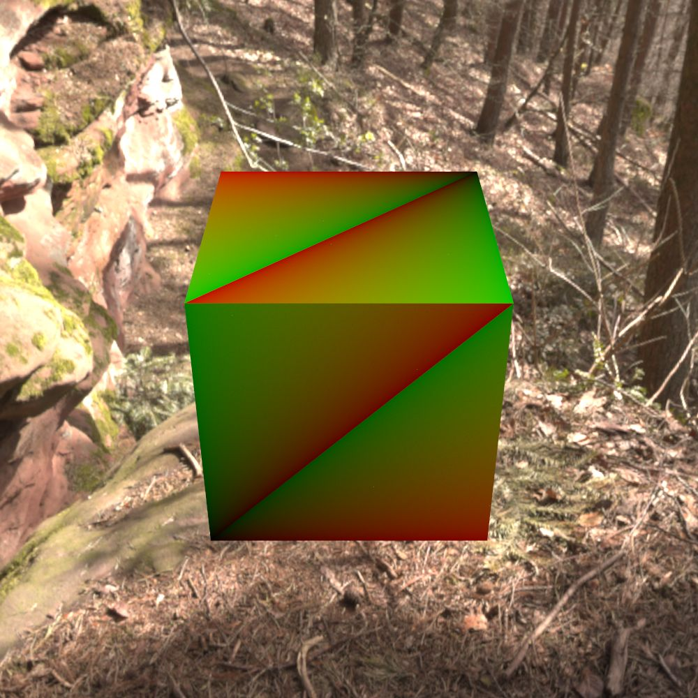
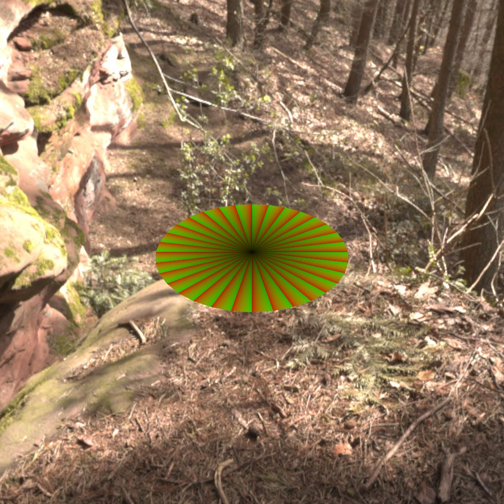
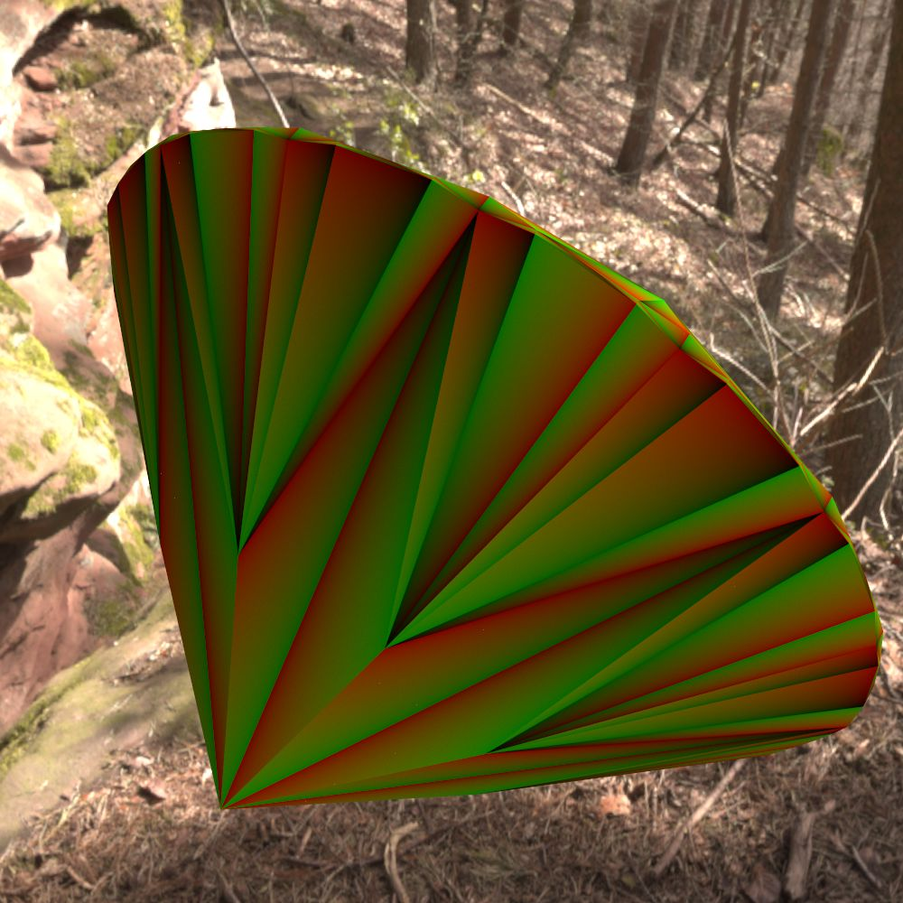

Shapes
======

Shapes represent geometry in the scene.

A shape is specified in the :monosp:`shapes` block with a :monosp:`name` and a :monosp:`type`.
The type has to be one of the shape listed at this section below.

.. code-block:: javascript
    
    {
        // ...
        "shape": [
            // ...
            {"name":"NAME", "type":"TYPE", /* DEPENDS ON TYPE */},
            // ...
        ]
        // ...
    }

.. NOTE:: Shapes do not support PExpr expressions.

.. _shape-triangle:

Triangle (:monosp:`triangle`)
-----------------------------

.. objectparameters::

  * - p0, p1, p2
    - |vector|
    - :code:`(0,0,0)`, :code:`(1,0,0)`, :code:`(0,1,0)`
    - Vertices of the triangle.

The parameters specified in :ref:`Triangular Mesh <shape-triangular-mesh>` can be used as well.

.. subfigstart::

.. figure::  images/shape_triangle.jpg
  :width: 90%
  :align: center
  
  Triangle shape with visualized primitive coordinates

.. subfigend::
  :width: 0.6
  :label: fig-shape-triangle

.. _shape-rectangle:

Rectangle (:monosp:`rectangle`)
-------------------------------

.. objectparameters::

  * - width, height
    - |number|
    - :code:`2`, :code:`2`
    - Width and height of the rectangle in the XY-Plane. The rectangle is centered around the parameter :monosp:`origin`.
  * - origin
    - |vector|
    - :code:`(0,0,0)`
    - The origin of the rectangle.
  * - p0, p1, p2, p3
    - |vector|
    - :code:`(-1,-1,0)`, :code:`(1,-1,0)`, :code:`(1,1,0)`, :code:`(-1,1,0)`
    - Vertices of the rectangle. This will only be used if no :monosp:`width` or :monosp:`height` is specified.

The parameters specified in :ref:`Triangular Mesh <shape-triangular-mesh>` can be used as well.

.. subfigstart::

  
  Rectangle shape with visualized primitive coordinates

.. subfigend::
  :width: 0.6
  :label: fig-shape-rectangle

.. _shape-box:

Box (:monosp:`box`)
-------------------

.. objectparameters::

  * - width, height, depth
    - |number|
    - :code:`2`, :code:`2`, :code:`2`
    - Width (x-axis), height (y-axis) and depth (z-axis) of the box. The box is centered around the parameter :monosp:`origin`.
  * - origin
    - |vector|
    - :code:`(0,0,0)`
    - The origin of the box.

The parameters specified in :ref:`Triangular Mesh <shape-triangular-mesh>` can be used as well.

.. subfigstart::

  
  Box shape with visualized primitive coordinates

.. subfigend::
  :width: 0.6
  :label: fig-shape-box

.. _shape-sphere:

Sphere (:monosp:`sphere`)
--------------------------------------------------

.. objectparameters::

  * - radius
    - |number|
    - :code:`1`
    - Radius of the sphere.
  * - center
    - |vector|
    - :code:`(0,0,0)`
    - The origin of the box.

.. NOTE:: In contrary to the other spheres, the constructed sphere is analytical and precise. Due to it not being constructed via triangle, the shape adds a new fundamental primitive type to the renderer, which in turn might decrease performance.

.. subfigstart::

.. figure::  images/shape_sphere.jpg
  :width: 90%
  :align: center
  
  Sphere shape with visualized primitive coordinates. The primitive coordinates map to the normalized spherical coordinates

.. subfigend::
  :width: 0.6
  :label: fig-shape-sphere

.. _shape-icosphere:

Ico-Sphere (:monosp:`icosphere`)
--------------------------------------------------

.. objectparameters::

  * - radius
    - |number|
    - :code:`1`
    - Radius of the sphere.
  * - center
    - |vector|
    - :code:`(0,0,0)`
    - The origin of the box.
  * - subdivions
    - |int|
    - :code:`4`
    - Number of subdivions used.

The parameters specified in :ref:`Triangular Mesh <shape-triangular-mesh>` can be used as well.

.. subfigstart::

  
  Ico sphere shape with visualized primitive coordinates. In contrary to the analytical sphere, the ico sphere consists of multiple tiny triangles

.. subfigend::
  :width: 0.6
  :label: fig-shape-icosphere

.. _shape-uvsphere:

UV-Sphere (:monosp:`uvsphere`)
------------------------------

.. objectparameters::

  * - radius
    - |number|
    - :code:`1`
    - Radius of the sphere.
  * - center
    - |vector|
    - :code:`(0,0,0)`
    - The origin of the box.
  * - stacks, slices
    - |int|
    - :code:`32`, :code:`16`
    - Stacks and slices used for internal triangulation.

The parameters specified in :ref:`Triangular Mesh <shape-triangular-mesh>` can be used as well.

.. subfigstart::

.. figure::  images/shape_uvsphere.jpg
  :width: 90%
  :align: center
  
  UV sphere shape with visualized primitive coordinates. In contrary to the analytical sphere, the uv sphere consists of multiple tiny triangles

.. subfigend::
  :width: 0.6
  :label: fig-shape-uvsphere

.. _shape-cylinder:

Cylinder (:monosp:`cylinder`)
-----------------------------

.. objectparameters::

  * - radius
    - |number|
    - :code:`1`
    - Radius of the cylinder for the top and bottom part.
  * - top_radius, bottom_radius
    - |number|
    - :code:`1`, :code:`1`
    - Radius of the cylinder for the top and bottom part respectively. Can not be used together with :monosp:`radius`.
  * - p0, p1
    - |vector|
    - :code:`(0,0,0)`, :code:`(0,0,1)`
    - The origin of the top and bottom of the cylinder respectively.
  * - filled
    - |bool|
    - |true|
    - Set |true| to fill the top and bottom of the cylinder.
  * - sections
    - |int|
    - :code:`32`
    - Sections used for internal triangulation.

The parameters specified in :ref:`Triangular Mesh <shape-triangular-mesh>` can be used as well.

.. subfigstart::

  
  Cylinder shape with visualized primitive coordinates

.. subfigend::
  :width: 0.6
  :label: fig-shape-cylinder

.. _shape-cone:

Cone (:monosp:`cone`)
---------------------

.. objectparameters::

  * - radius
    - |number|
    - :code:`1`
    - Radius of the cone.
  * - p0, p1
    - |vector|
    - :code:`(0,0,0)`, :code:`(0,0,1)`
    - The origin of the top and bottom of the cone respectively.
  * - filled
    - |bool|
    - |true|
    - Set |true| to fill the bottom of the cone.
  * - sections
    - |int|
    - :code:`32`
    - Sections used for internal triangulation.

The parameters specified in :ref:`Triangular Mesh <shape-triangular-mesh>` can be used as well.

.. subfigstart::

.. figure::  images/shape_cone.jpg
  :width: 90%
  :align: center
  
  Cone shape with visualized primitive coordinates

.. subfigend::
  :width: 0.6
  :label: fig-shape-cone

.. _shape-disk:

Disk (:monosp:`disk`)
---------------------

.. objectparameters::

  * - radius
    - |number|
    - :code:`1`
    - Radius of the disk.
  * - origin
    - |vector|
    - :code:`(0,0,0)`
    - The origin of the disk.
  * - normal
    - |vector|
    - :code:`(0,0,1)`
    - The normal of the disk.
  * - sections
    - |int|
    - :code:`32`
    - Sections used for internal triangulation.

The parameters specified in :ref:`Triangular Mesh <shape-triangular-mesh>` can be used as well.

.. subfigstart::

  
  Disk shape with visualized primitive coordinates

.. subfigend::
  :width: 0.6
  :label: fig-shape-disk

.. _shape-obj:

Wavefront Object Format (:monosp:`obj`)
---------------------------------------

.. objectparameters::

  * - filename
    - |string|
    - *None*
    - Path to a valid .obj file.
  * - shape_index
    - |int|
    - :code:`-1`
    - If greater or equal 0 a specific shape given by the index will be loaded, else all shapes will be merged to one.

The parameters specified in :ref:`Triangular Mesh <shape-triangular-mesh>` can be used as well.

.. _shape-ply:

Polygon File Format (:monosp:`ply`)
-----------------------------------

.. objectparameters::

  * - filename
    - |string|
    - *None*
    - Path to a valid .ply file.

The parameters specified in :ref:`Triangular Mesh <shape-triangular-mesh>` can be used as well.

.. _shape-mitsuba:

Mitsuba Serialized Format (:monosp:`mitsuba`)
---------------------------------------------

.. objectparameters::

  * - filename
    - |string|
    - *None*
    - Path to a valid .serialized or .mts file.
  * - shape_index
    - |int|
    - :code:`0`
    - A Mitsuba Serialized Format is able to contain multiple shapes. This parameter allows to select the requested one.

The parameters specified in :ref:`Triangular Mesh <shape-triangular-mesh>` can be used as well.

.. _shape-external:

External File (:monosp:`external`)
----------------------------------

.. objectparameters::

  * - filename
    - |string|
    - *None*
    - Path to a valid file with a known file extension.

This type of shape will load a obj (.obj), ply (.ply) or mitsuba serialized mesh (.mts or .serialized) depending on the extension of the filename. Additional properties will be forwarded to the actual shape type.

.. subfigstart::

  
  External shape (the diamond used in the showcase) with visualized primitive coordinates

.. subfigend::
  :width: 0.6
  :label: fig-shape-external

.. _shape-inline:

Inline Mesh (:monosp:`inline`)
----------------------------------

.. objectparameters::

  * - indices
    - |array| of |int|
    - *none*
    - Indices for a list of triangles given as a flat list of integers. The number of entries must be a multiple of 3. Only triangles are currently supported.
  * - vertices
    - |array| of |number|
    - *none*
    - Three dimensional vertices given as a flat list of numbers. The number of entries must be a multiple of 3.
  * - normals
    - |array| of |number|
    - *none*
    - Three dimensional normals given as a flat list of numbers. The number of entries must be a multiple of 3 and must match the number of vertices.
  * - texcoords
    - |array| of |number|
    - *none*
    - Two dimensional texture coordinates given as a flat list of numbers. The number of entries must be a multiple of 2 and must match the number of vertices.

The parameters specified in :ref:`Triangular Mesh <shape-triangular-mesh>` can be used as well.

.. NOTE:: A list of |number| or |int| can be specified via the ``{"type": "number", values=[...]}`` with ``number`` or ``integer`` as type respectively.

.. WARNING:: It is recommended to use external files for large meshes, as the scene description is not intended to host large data. The :monosp:`inline` should be used for interop between different frameworks and very small meshes.

.. subfigstart::

.. figure::  images/shape_inline.jpg
  :width: 90%
  :align: center
  
  Inline custom plane specified directly in the scene file

.. subfigend::
  :width: 0.6
  :label: fig-shape-external

.. literalinclude:: ../../../scenes/showcase/shape/inline.json
    :language: javascript
    :tab-width: 4
    :lines: 4-10
    :linenos:
    :dedent:
    :emphasize-lines: 5-6
    :caption: The following shape definition is a simple example of an inlined mesh specification. 

.. _shape-triangular-mesh:

Triangular Mesh
---------------

A triangular mesh specified above can have the following parameters additionally to the mentioned above as well:

.. objectparameters::

  * - flip_normals
    - |bool|
    - |false|
    - Flip the normals.
  * - face_normals
    - |bool|
    - |false|
    - Use normals from triangles as vertex normals. This will let the object look *hard*.
  * - smooth_normals
    - |bool|
    - |false|
    - Use shared normals from triangles as vertex normals. This will let the object look *smooth*.
  * - generic_uv
    - |bool|
    - |false|
    - Compute normalized texture coordinates based on the local bounding box. Will replace previously defined texture coordinates.
  * - subdivision
    - |int|
    - :code:`0`
    - Number of triangular subdivisions to apply.
  * - refinement
    - |number|
    - :code:`0`
    - Adaptive threshold. If greater than zero, triangles greater or equal than the threshold will be subdivided until all triangle areas are less than the given threshold.
  * - displacement
    - |string|
    - *None*
    - Path to a image file containing grayscale values. This can not be an PExpr nor a reference to a texture. Use a plain filename.
  * - displacement_amount
    - |number|
    - :code:`1`
    - Amount of displacement to apply. Can be negative to make the displacement inwards.
  * - transform
    - |transform|
    - Identity
    - Apply given transformation to shape.

.. WARNING:: Keep in mind that parameters like :paramtype:`subdivision`, :paramtype:`refinement` and :paramtype:`displacement` have a large impact on the performance of the loading process. If possible, the process should be precomputed with external software for large objects.

.. NOTE:: Displacement within a shape is a tesselation step and creates a more dense mesh. Support for dynamic patterns and entities is planned for the future and will be implemented in the :ref:`Entity <Entities>` interface.