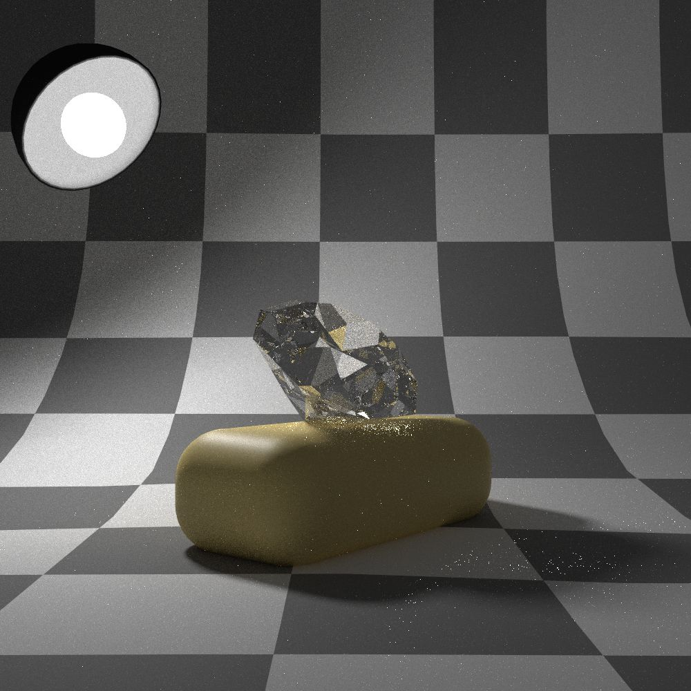
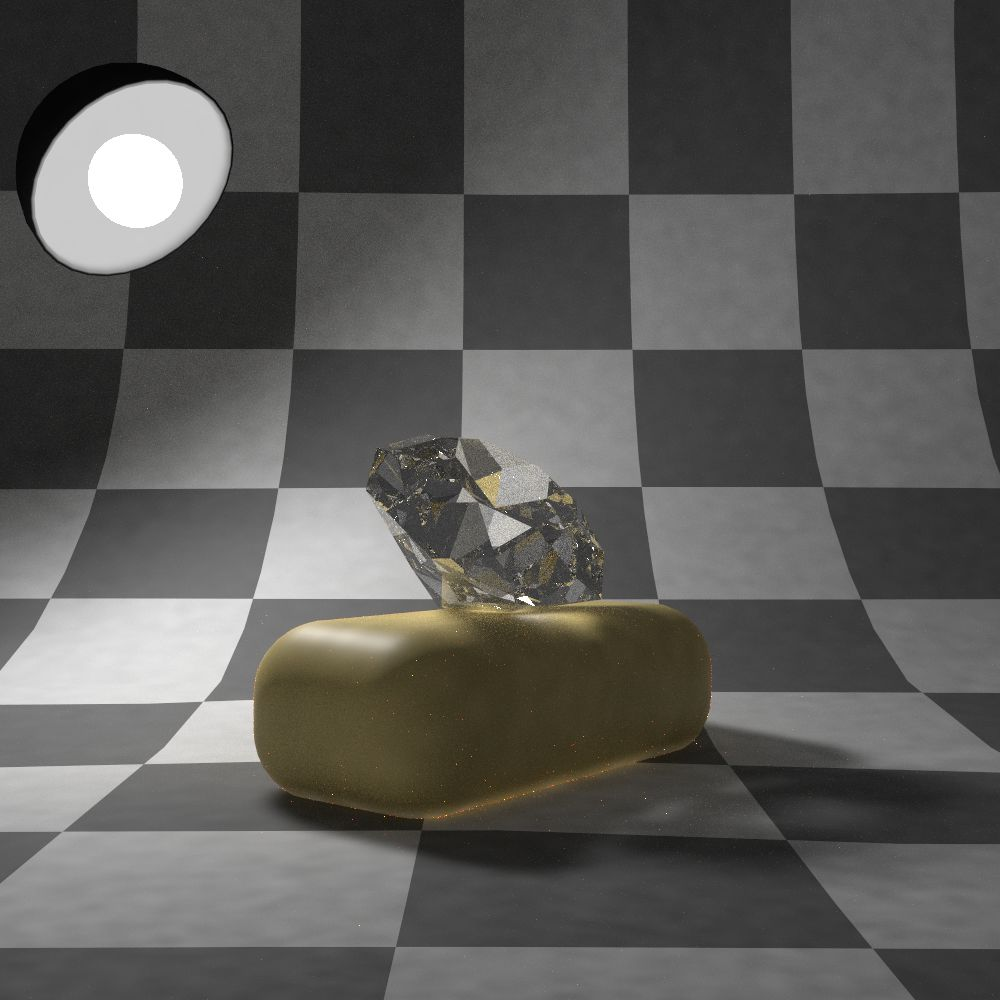

Techniques
==========

Techniques, also called integrators, are the heart of the rendering framework.
They allow the calculation of global illumination based on different methods or the acquisition of information about the underlying scene.

A technique is specified in the :monosp:`technique` block with a :monosp:`type`.
The type has to be one of the techniques listed at this section below.

.. NOTE:: Techniques do not support PExpr expressions.

Path Tracer (:monosp:`path`)
---------------------------------------------

.. objectparameters::

  * - max_depth
    - |int|
    - :code:`64`
    - Maximum depth of rays to be traced.
  * - clamp
    - |number|
    - :code:`0`
    - Value to clamp contributions to. This introduces bias in favour of omitting outlier. 0 disables clamping.
  * - light_selector
    - |string|
    - :code:`"uniform"`
    - Light selection technique. Available are :code:`"hierarchy"`, :code:`"simple"` and :code:`"uniform"`
  * - aov_normals
    - |bool|
    - |false|
    - Enable normal output as aov.
  * - aov_mis
    - |bool|
    - |false|
    - Enable two aovs displaying mis related weights.

This is the default and probably most used type. It calculates the full global illumination in the scene.
If participating media is used, it is recommended to use the volumetric path tracer instead.

.. subfigstart::
  
.. figure:: images/technique_path.jpg
  :width: 90%

  A low-sample render using the path technique

.. subfigend::
  :width: 0.6
  :label: fig-path-technique

Volume Path Tracer (:monosp:`volpath`)
---------------------------------------------

.. objectparameters::

  * - max_depth
    - |int|
    - :code:`64`
    - Maximum depth of rays to be traced.
  * - clamp
    - |number|
    - :code:`0`
    - Value to clamp contributions to. This introduces bias in favour of omitting outlier. 0 disables clamping.
  * - light_selector
    - |string|
    - :code:`"uniform"`
    - Light selection technique. Available are :code:`"hierarchy"`, :code:`"simple"` and :code:`"uniform"`

A simple volumetric path tracer. It calculates the full global illumination in the scene.

.. subfigstart::
  

  A low-sample render using the volumetric path technique. In this picture no volumes were used, converging to the same result as the standard path tracer.

.. subfigend::
  :width: 0.6
  :label: fig-volpath-technique

Light Tracer (:monosp:`lighttracer`)
---------------------------------------------

.. objectparameters::

  * - max_depth
    - |int|
    - :code:`64`
    - Maximum depth of rays to be traced.
  * - clamp
    - |number|
    - :code:`0`
    - Value to clamp contributions to. This introduces bias in favour of omitting outlier. 0 disables clamping.
  * - light_selector
    - |string|
    - :code:`"uniform"`
    - Light selection technique. Available are :code:`"hierarchy"`, :code:`"simple"` and :code:`"uniform"`

A basic light tracer. Primarily developed as a proof-of-concept for the project framework. It fails to display fully specular paths.

.. NOTE:: The light tracer is very basic and misses many features. This might change in the future.

.. WARNING:: At the time of this writing the light tracer still has some problems and is not recommended to be used.

.. subfigstart::
  
.. figure:: images/technique_lt.jpg
  :width: 90%

  A low-sample render using light tracing. It fails to display fully specular paths, as a path starting from a light source through a perfect specular path can **not** hit a virtual camera randomly.

.. subfigend::
  :width: 0.6
  :label: fig-lt-technique

Photonmapper (:monosp:`photonmapper`)
---------------------------------------------

.. objectparameters::

  * - max_camera_depth
    - |int|
    - :code:`64`
    - Maximum depth of rays starting from the camera.
  * - max_light_depth
    - |int|
    - :code:`8`
    - Maximum depth of rays starting from a light source.
  * - photons
    - |int|
    - :code:`1000000`
    - Number of photons emitted into the scene.
  * - radius
    - |number|
    - :code:`0.01`
    - Initial merging radius.
  * - clamp
    - |number|
    - :code:`0`
    - Value to clamp contributions to. This introduces bias in favour of omitting outlier. 0 disables clamping.
  * - aov
    - |bool|
    - |false|
    - Enable aovs displaying internal weights.

A basic photon mapping technique. Primarily developed as a proof-of-concept for the project framework.

.. NOTE:: The photon mapper is very basic and more recent advancements are not used. This will change in the future.

.. subfigstart::
  

  A low-sample render using photon mapping. The footprint of each photon is clearly visible. However, the technique exceeds in displaying the caustics, whom are missing in the standard path tracing technique. 

.. subfigend::
  :width: 0.6
  :label: fig-ppm-technique

Ambient Occlusion (:monosp:`ao`)
---------------------------------------------

This technique calculates the ambient occlusion in the scene. Currently no parameters are available to tinkle around.

.. subfigstart::
  

  A low-sample ambient occlusion rendering. The images looks almost converged, which is due to the grayscale appearance and large number of samples within each bounce.

.. subfigend::
  :width: 0.6
  :label: fig-ao-technique

Wireframe (:monosp:`wireframe`)
---------------------------------------------

This technique renders the scene in wireframe. Currently no parameters are available to tinkle around.

.. subfigstart::
  
.. figure:: images/technique_wireframe.jpg
  :width: 90%

  A basic visualization of the scene using wireframes.

.. subfigend::
  :width: 0.6
  :label: fig-wireframe-technique

Debug (:monosp:`debug`)
---------------------------------------------

.. objectparameters::

  * - mode
    - |string|
    - :code:`"Normal"`
    - Property to display or check. One of the options displayed in ``igview`` when using the debug mode ``--debug``.

This is a special technique only usable with the :monosp:`igview` frontend. It displays scene specific information on the screen.

.. subfigstart::
  

  Debug visualization of the scene displaying the shading normals.

.. subfigend::
  :width: 0.6
  :label: fig-debug-technique

Other
-----

The interested reader might have found that Ignis contains some more techniques. These are primarily intended for development and test purposes and are therefore not further documented at this page.
