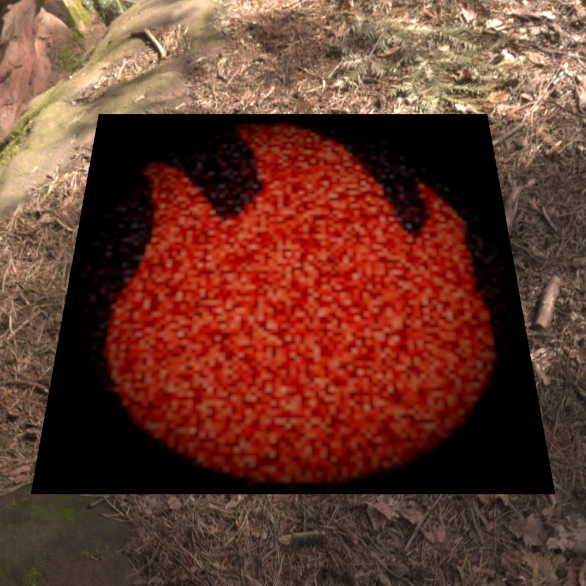
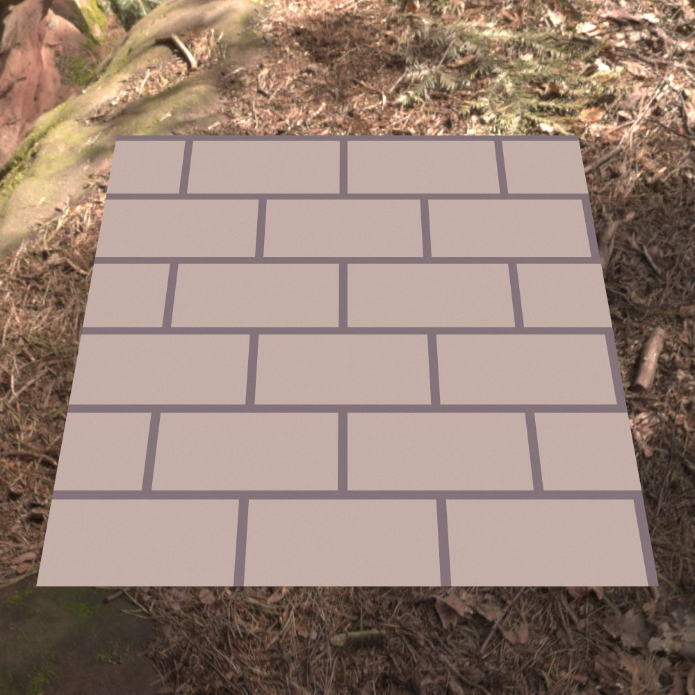
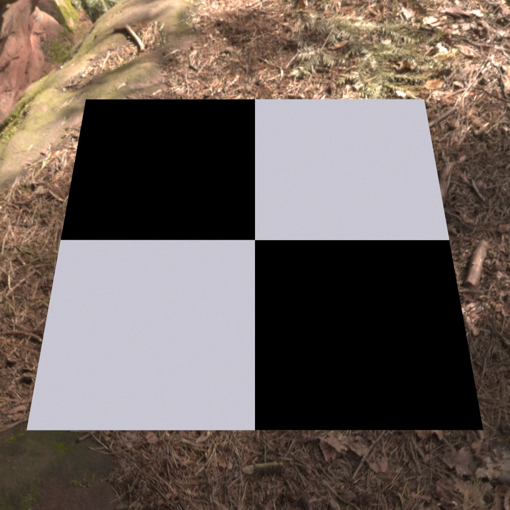
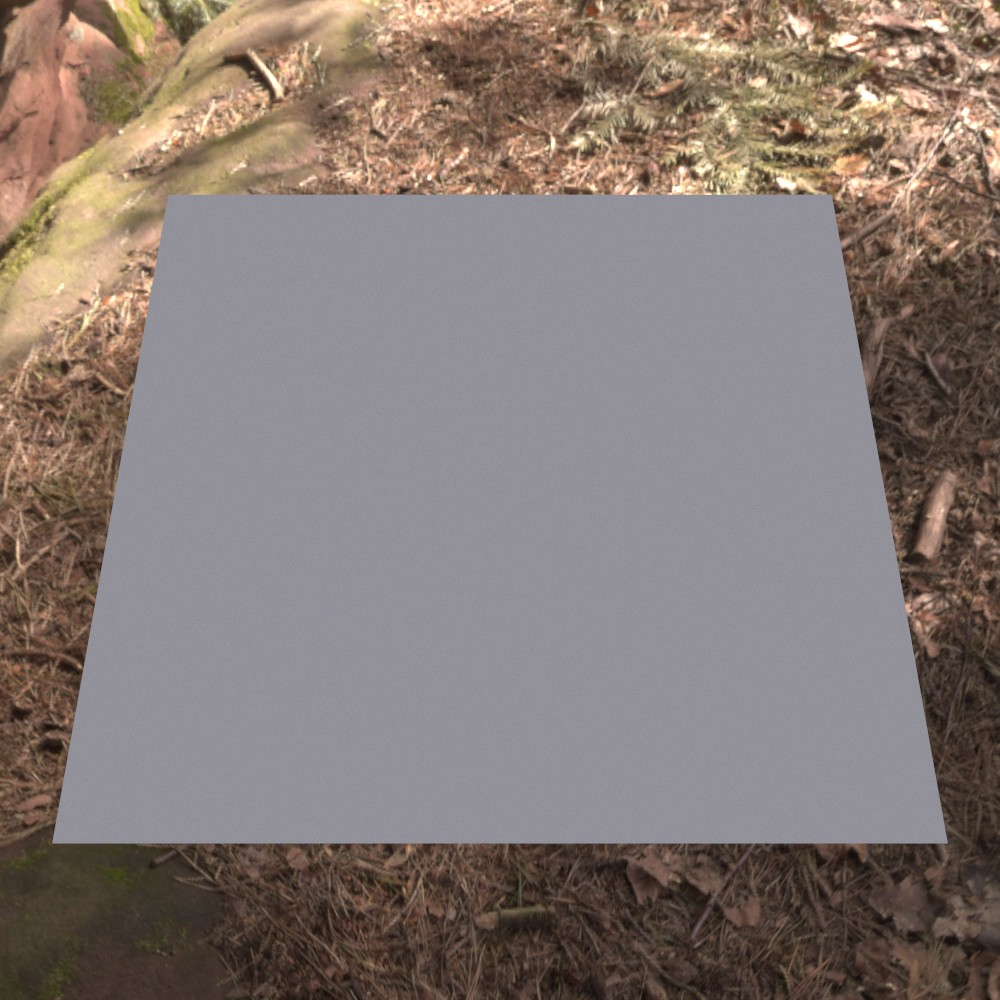
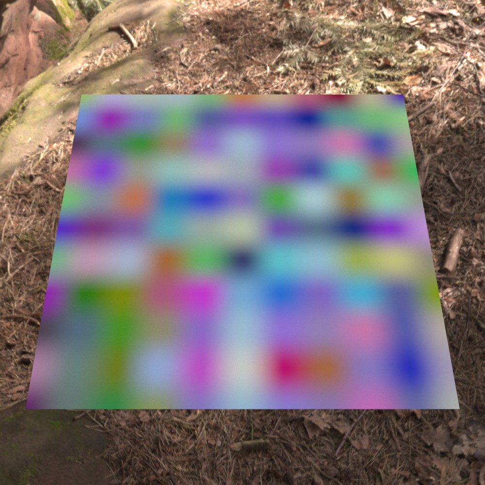
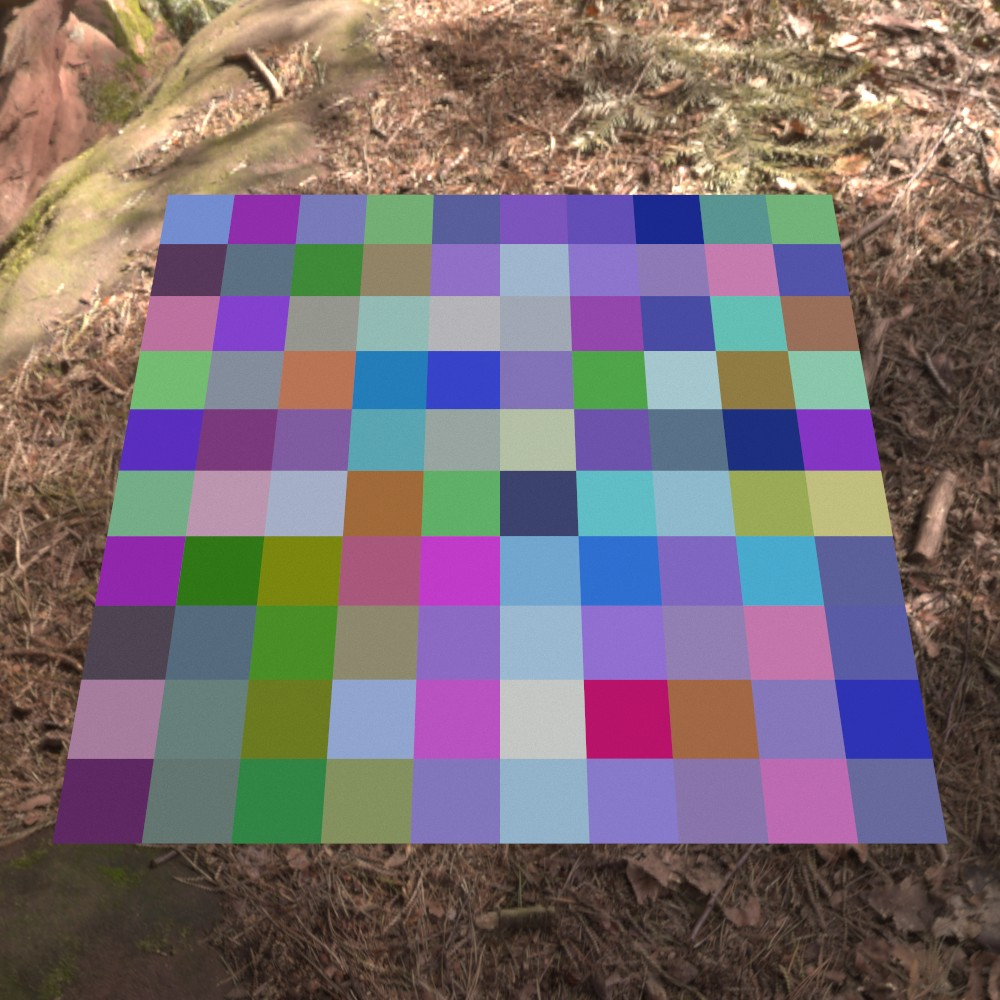
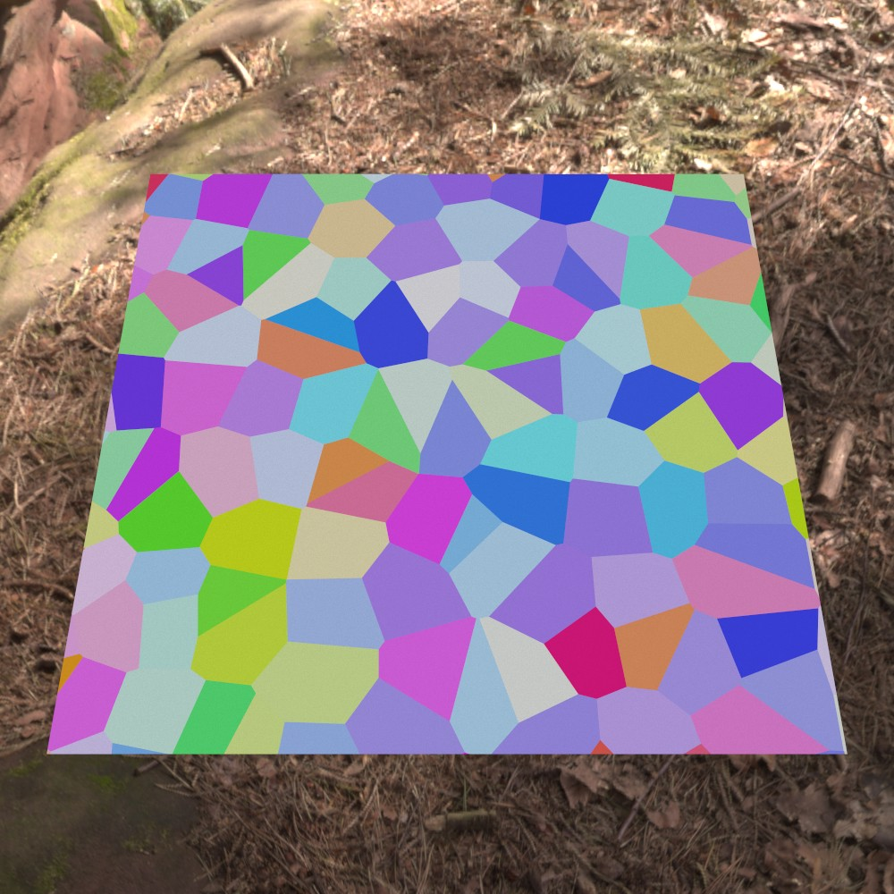
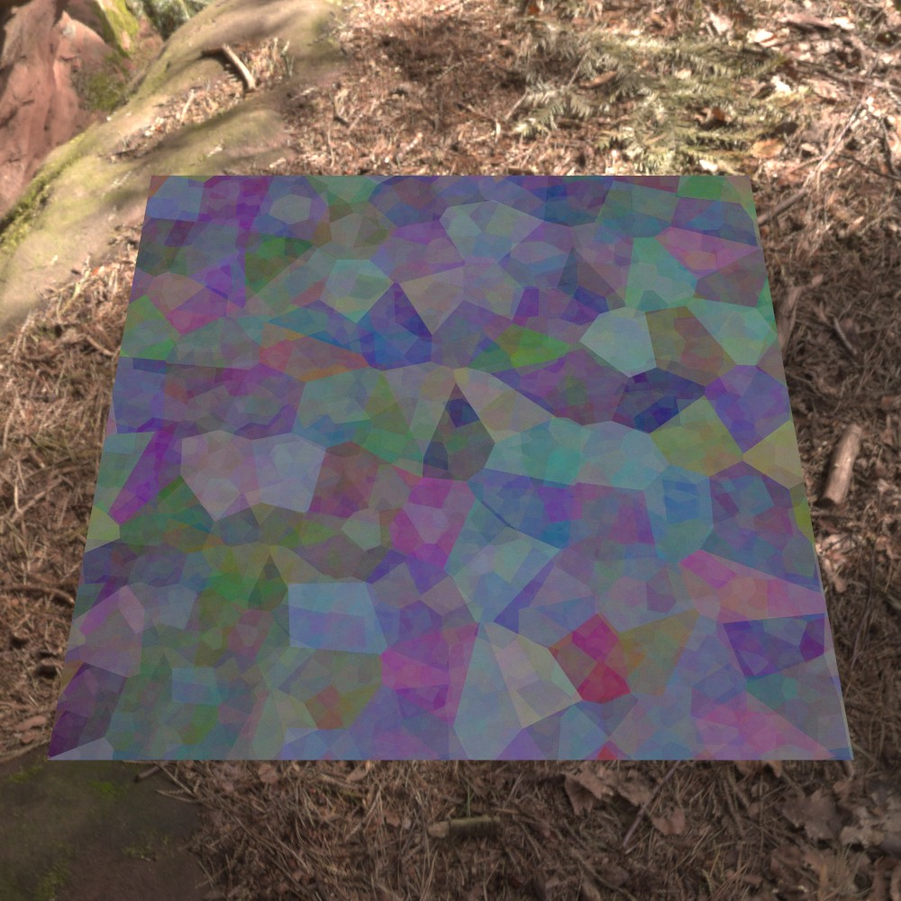
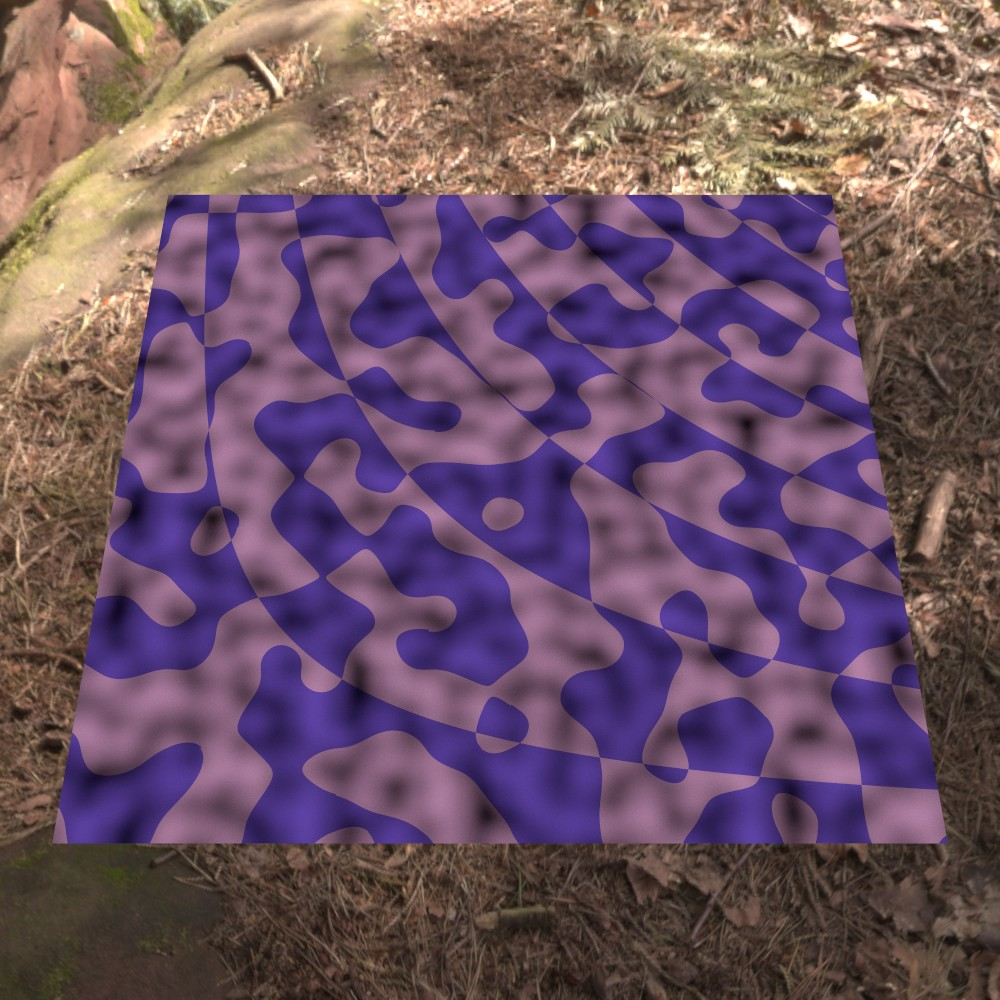
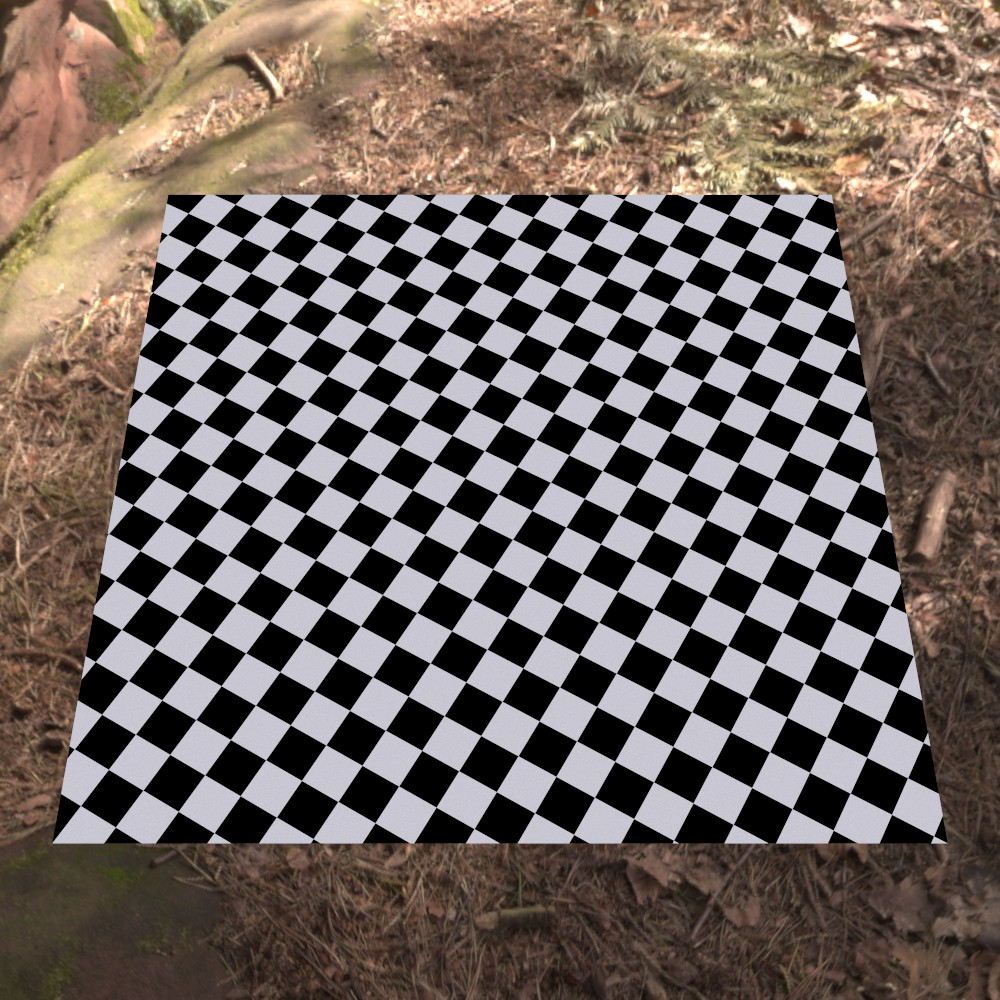

Textures
========

Textures in Ignis are patterns, nodes or other building blocks for shading networks.

All number and color parameters can be connected to a shading network or texture via :ref:`PExpr <PExpr>` to build an actual tree. Cycles are prohibited.

A texture is specified in the :monosp:`textures` block with a :monosp:`name` and a :monosp:`type`.
The type has to be one of the textures listed at this section below.

.. code-block:: javascript
    
    {
        // ...
        "textures": [
            // ...
            {"name":"NAME", "type":"TYPE", /* DEPENDS ON TYPE */},
            // ...
        ]
        // ...
    }

Image texture (:monosp:`image`)
-------------------------------

.. objectparameters::

  * - filename
    - |string|
    - *None*
    - No
    - Path to a valid image file.
  * - filter_type
    - |string|
    - :code:`"bilinear"`
    - No
    - The filter type to be used. Has to be one of the following: ["bilinear", "nearest"].
  * - wrap_mode
    - |string|
    - :code:`"repeat"`
    - No
    - The wrap method to be used. Has to be one of the following: ["repeat", "mirror", "clamp"].
  * - transform
    - |transform|
    - Identity
    - No
    - Optional 2d transformation applied to texture coordinates.
  * - linear
    - |bool|
    - |false|
    - No
    - The given image file is already in linear space and inverse gamma mapping can be skipped. Ignored for EXR and HDR images as it is expected that they are always in linear space.

.. subfigstart::

  
  Image texture

.. subfigend::
  :width: 0.6
  :label: fig-image

Brick (:monosp:`brick`)
-------------------------------------

.. objectparameters::

  * - color0, color1
    - |color|
    - :code:`0`, :code:`1`
    - Yes
    - The colors to used for the brick. color0 is the mortar, color1 is the actual brick.
  * - scale_x, scale_y
    - |number|
    - :code:`6`, :code:`3`
    - Yes
    - Numbers of grids in a normalized frame [0,0]x[1,1].
  * - gap_x, gap_y
    - |number|
    - :code:`0.05`, :code:`0.1`
    - Yes
    - Normalized gap size.
  * - transform
    - |transform|
    - Identity
    - No
    - Optional 2d transformation applied to texture coordinates.

.. subfigstart::

  
  Brick texture

.. subfigend::
  :width: 0.6
  :label: fig-brick

Checkerboard (:monosp:`checkerboard`)
-------------------------------------

.. objectparameters::

  * - color0, color1
    - |color|
    - :code:`0`, :code:`1`
    - Yes
    - The colors to use in the checkerboard.
  * - scale_x, scale_y
    - |number|
    - :code:`2`, :code:`2`
    - Yes
    - Numbers of grids in a normalized frame [0,0]x[1,1].
  * - transform
    - |transform|
    - Identity
    - No
    - Optional 2d transformation applied to texture coordinates.

.. subfigstart::

  
  Checkerboard texture

.. subfigend::
  :width: 0.6
  :label: fig-checkerboard

Noise (:monosp:`noise`)
-----------------------

.. objectparameters::

  * - color
    - |color|
    - :code:`1`
    - Yes
    - Tint
  * - colored
    - |bool|
    - |false|
    - No
    - True will generate a colored texture, instead of a grayscale one.

.. subfigstart::

  
  Noise texture, a slight color noise is visible

.. subfigend::
  :width: 0.6
  :label: fig-noise

Interpolated Noise (:monosp:`pnoise`)
-------------------------------------

Original noise used in legacy perlin implementation.

.. objectparameters::

  * - color
    - |color|
    - :code:`1`
    - Yes
    - Tint
  * - colored
    - |bool|
    - |false|
    - No
    - True will generate a colored texture, instead of a grayscale one.
  * - scale_x, scale_y
    - |number|
    - :code:`20`, :code:`20`
    - Yes
    - Numbers of grids used for noise in a normalized frame [0,0]x[1,1].
  * - transform
    - |transform|
    - Identity
    - No
    - Optional 2d transformation applied to texture coordinates.

.. subfigstart::

  
  PNoise texture

.. subfigend::
  :width: 0.6
  :label: fig-pnoise

Cell Noise (:monosp:`cellnoise`)
--------------------------------

.. objectparameters::

  * - color
    - |color|
    - :code:`1`
    - Yes
    - Tint
  * - colored
    - |bool|
    - |false|
    - No
    - True will generate a colored texture, instead of a grayscale one.
  * - scale_x, scale_y
    - |number|
    - :code:`20`, :code:`20`
    - Yes
    - Numbers of grids used for noise in a normalized frame [0,0]x[1,1].
  * - transform
    - |transform|
    - Identity
    - No
    - Optional 2d transformation applied to texture coordinates.

.. subfigstart::

  
  Cell noise texture

.. subfigend::
  :width: 0.6
  :label: fig-cellnoise

Perlin Noise (:monosp:`perlin`)
-------------------------------

.. objectparameters::

  * - color
    - |color|
    - :code:`1`
    - Yes
    - Tint
  * - colored
    - |bool|
    - |false|
    - No
    - True will generate a colored texture, instead of a grayscale one.
  * - scale_x, scale_y
    - |number|
    - :code:`20`, :code:`20`
    - Yes
    - Numbers of grids used for noise in a normalized frame [0,0]x[1,1].
  * - transform
    - |transform|
    - Identity
    - No
    - Optional 2d transformation applied to texture coordinates.

.. subfigstart::

.. figure::  images/tex_perlin.jpg
  :width: 90%
  :align: center
  
  Perlin noise texture

.. subfigend::
  :width: 0.6
  :label: fig-perlin

Voronoi Noise (:monosp:`voronoi`)
---------------------------------

.. objectparameters::

  * - color
    - |color|
    - :code:`1`
    - Yes
    - Tint
  * - colored
    - |bool|
    - |false|
    - No
    - True will generate a colored texture, instead of a grayscale one.
  * - scale_x, scale_y
    - |number|
    - :code:`20`, :code:`20`
    - Yes
    - Numbers of grids used for noise in a normalized frame [0,0]x[1,1].
  * - transform
    - |transform|
    - Identity
    - No
    - Optional 2d transformation applied to texture coordinates.

.. subfigstart::

  
  Voronoi texture

.. subfigend::
  :width: 0.6
  :label: fig-voronoi

Fractional Brownian Motion (:monosp:`fbm`)
------------------------------------------

.. objectparameters::

  * - color
    - |color|
    - :code:`1`
    - Yes
    - Tint
  * - colored
    - |bool|
    - |false|
    - No
    - True will generate a colored texture, instead of a grayscale one.
  * - scale_x, scale_y
    - |number|
    - :code:`20`, :code:`20`
    - Yes
    - Numbers of grids used for noise in a normalized frame [0,0]x[1,1].
  * - transform
    - |transform|
    - Identity
    - No
    - Optional 2d transformation applied to texture coordinates.

.. subfigstart::

  
  FBM texture

.. subfigend::
  :width: 0.6
  :label: fig-fbm

Expression (:monosp:`expr`)
------------------------------------------

A custom :ref:`PExpr <PExpr>` expression with optional parameters.

Available are color (``vec4``), vector (``vec3``), number (``num``) and ``bool`` variables. 
The parameters used inside the expression have to be prefixed with ``color_``, ``vec_``, ``num_`` and ``bool_`` respectively.

E.g., ``color_tint`` will be called ``tint`` inside the expression.

.. objectparameters::

  * - expr
    - |string|
    - *None*
    - Yes
    - A :ref:`PExpr <PExpr>` based expression

.. subfigstart::

  
  Custom texture generated by an expression

.. subfigend::
  :width: 0.6
  :label: fig-expr

Texture transform (:monosp:`transform`)
---------------------------------------------

.. objectparameters::

  * - texture
    - |color|
    - *None*
    - Yes
    - The texture the transform is applied to.
  * - transform
    - |transform|
    - Identity
    - No
    - 2d transformation applied to texture coordinates.

.. subfigstart::

  
  Transformed texture as a texture

.. subfigend::
  :width: 0.6
  :label: fig-expr
